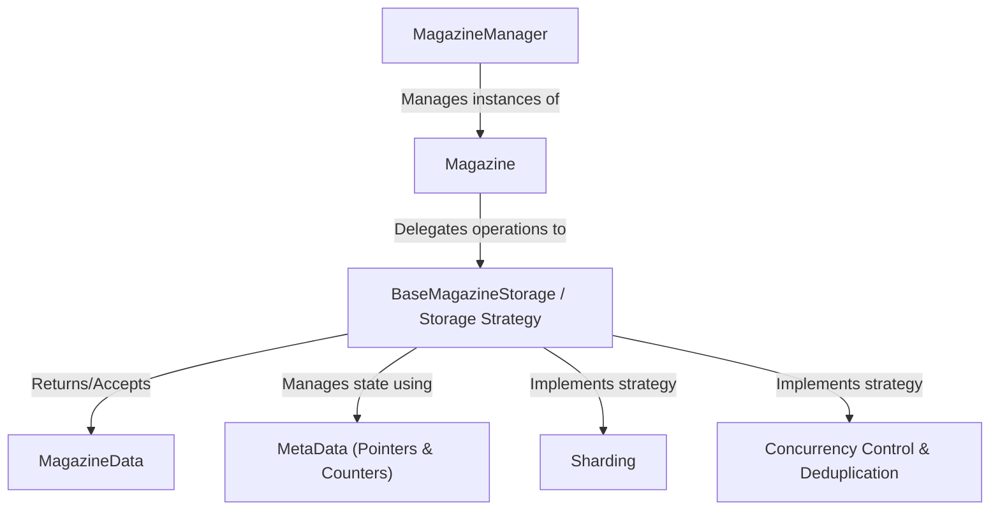

## Magazine

The Magazine Java library streamlines the management of temporary, homogenous data.  In many applications, we encounter situations where we need to persist a collection of similar data objects for a specific duration, and then retrieve and utilize them on demand.  This pattern necessitates a robust mechanism for loading the data into memory, ejecting or "firing" it when it's no longer immediately needed (perhaps to free up resources), and efficiently reloading it when required again.

Inspired by the mechanics of a rifle magazine, this library provides a simple and intuitive way to load and "fire" data, leveraging a user-configurable storage solution for persistence.  This allows developers to choose the most appropriate storage mechanism for their specific needs, whether it's an in-memory cache, a local file, or a more sophisticated database.  Furthermore, a Magazine Manager component enables applications to orchestrate multiple magazines, each potentially holding different types of data, all within a unified framework.

Beyond the fundamental capabilities of loading, reloading, and on-demand data retrieval, Magazine offers valuable insights into its operation by providing statistics on overall load and "fire" attempts.  These metrics can be instrumental in understanding data access patterns and optimizing application performance.

## Provided Features 

- Temporary Homogenous Data Management: Simplifies handling collections of similar data objects for a specific duration.
- Loading Data: Provides a mechanism to load data into a distributed persistent queue.
- Firing Data: Enables retrieval of loaded data from a distributed persistent queue.
- Magazine Management: Facilitates the management of multiple magazines, potentially holding different data types.
- Reloading Data: Offers the ability to reload data into a magazine, especially if it was previously "fired."

## Tutorials 

## Chapters

1. [Magazine
   ](tutorials/magazine.md)
2. [MagazineData
   ](tutorials/magazinedata.md)
3. [MagazineManager
   ](tutorials/magazinemanager.md)
4. [BaseMagazineStorage / Storage Strategy
   ](tutorials/base_magazine_storage__storage_strategy.md)
5. [MetaData (Pointers & Counters)
   ](tutorials/metadata_pointers_counters.md)
6. [Concurrency Control & Deduplication
   ](tutorials/concurrency_control__deduplication.md)
7. [Sharding
   ](tutorials/sharding.md)

## Usage

#### Add Maven Dependency

```xml
<dependency>
    <groupId>com.phonepe</groupId>
    <artifactId>magazine</artifactId>
    <version>1.0.0</version>
</dependency>

```

#### Create Magazine Manager
```java
MagazineManager magazineManager = new MagazineManager(CLIENT_ID)
```

#### Implementation
```java

//To Refresh Magazines
public static void refreshMagazines() {
        List<Magazine<?>> magazines;  //Create List of Magazines
        magazineManager.refresh(magazines);  //Refresh magazines
}
 
//Fire (from magazine)
magazineManager.getMagazine(MAGAZINE_IDENTIFIER, String.class).fire()
                    .orElseThrow(//Any Exception)
 
//Load (to magazine)
magazineManager.getMagazine(MAGAZINE_IDENTIFIER, String.class).load(data);
 
//Reload (to magazine)      
magazineManager.getMagazine(MAGAZINE_IDENTIFIER, String.class).reload(data);
 
//Get MetaData (of magazine)
magazineManager.getMagazine(MAGAZINE_IDENTIFIER, String.class).getMetaData();
```

## Manage Magazine

Every Magazine is identified by a unique Id. When dealing with multiple magazines, this unique Id is used to carry out operations on a specific magazine. Magazine manager acts as a facade when dealing with multiple magazines. The restriction of data homogeneity is limited to a magazine, however, magazine manager can manage magazines of heterogeneous nature.

Following functionalities are possible in the magazine.


**`load(String magazineIdentifier, T data)`** \
 Used to store data into specific magazine, throws exception when the data load is failed datastore

**`T fire(String magazineIdentifier)`** \
Method to get the loaded data from the magazine. throws exception when the data is not present / failed to fire from below datastore.

**`reload(String magazineIdentifier, T data)`** \
 To reload data into magazine, if missed by fire(from magazine).

**`Map<String, Metadata> getMetaData(String magazineIdentifier)`** \
method to get the metadata of the magazine i.e to get the number of loaded or fired, pointers and counters.

To manage multiple magazines of different type, there is a magazine manager which supports dynamic addition/deletion of magazines in the current magazine map.

**`delete(MagazineData<T> magazineData) `**\
Method to delete the provided MagazineData from the magazine.

**`peek(String magzineId, Map<Integer, Set<Long>> shardPointersMap)`**\
Method is used to Peek data from specific shards and pointers within the magazine. It accepts magazine identifiers as string
and a map where keys are shard identifiers and values are sets of pointers to peek from


## Architecture


