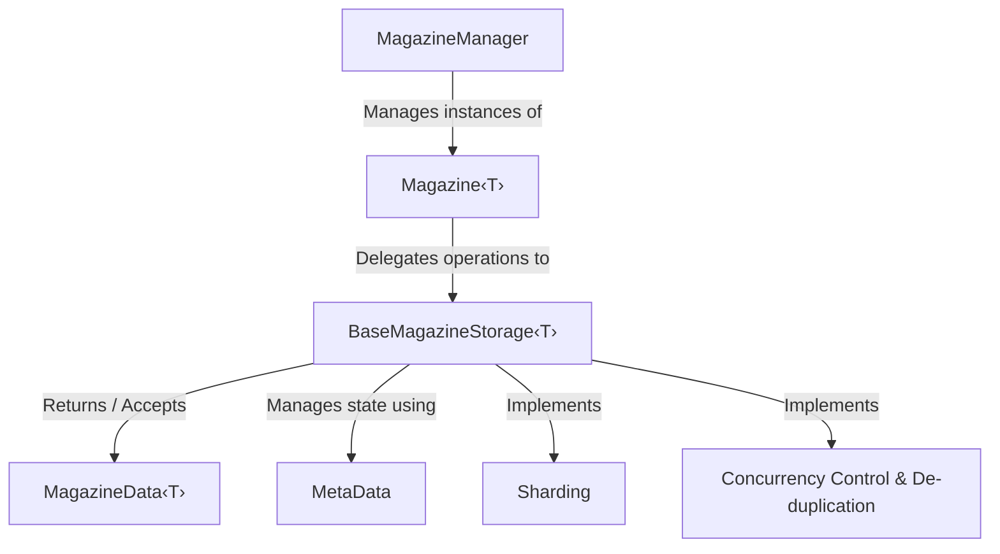

# Magazine

> A distributed persistent queue for homogeneous data management in Java.

[](https://central.sonatype.com/artifact/com.phonepe/magazine-core)
[](https://github.com/PhonePe/Magazine/actions/workflows/maven.yml)
[](https://opensource.org/licenses/Apache-2.0)
[](https://openjdk.org/projects/jdk/17/)

## Overview

Magazine is a Java library that streamlines the management of homogeneous data requiring persistence for a duration and on-demand consumption. Inspired by the mechanics of a rifle magazine, it provides a simple and intuitive API to **load**, **fire**, and **reload** data, backed by a pluggable, distributed storage layer.


```mermaid
flowchart TD
    A1["MagazineManager"] -- "Manages instances of" --> A0["Magazine‹T›"]
    A0 -- "Delegates operations to" --> A2["BaseMagazineStorage‹T›"]
    A2 -- "Returns / Accepts" --> A3["MagazineData‹T›"]
    A2 -- "Manages state using" --> A4["MetaData"]
    A2 -- "Implements" --> A5["Sharding"]
    A2 -- "Implements" --> A6["Concurrency Control & De-duplication"]
```

## Features

| Feature | Description |
|---|---|
| **Load / Fire / Reload** | Queue-like semantics with pointer-based reads |
| **Sharding** | Configurable shard count for horizontal throughput |
| **De-duplication** | Optional distributed lock-based de-dup on write |
| **Storage abstraction** | Aerospike implementation with an extensible storage contract |
| **Magazine Manager** | Orchestrate multiple heterogeneous magazines |
| **Dropwizard dashboard** | Optional read-only metadata and bounded peek UI |

## Modules

| Module | Artifact | Purpose |
|---|---|---|
| Root reactor | `com.phonepe:magazine` | Aggregator POM for the Magazine 2.x modules |
| `magazine-core` | `com.phonepe:magazine-core` | Magazine API and Aerospike storage implementation |
| `magazine-dw-bundle` | `com.phonepe:magazine-dw-bundle` | Extensible Dropwizard 5 integration, read APIs, and dashboard |

Magazine 2.0 intentionally moves the library JAR from `com.phonepe:magazine` to `com.phonepe:magazine-core`. Java packages remain unchanged. This coordinate change is the expected breaking change for the major release.

## Quick Start

### 1. Add Dependency

**Maven**

```xml
<dependency>
    <groupId>com.phonepe</groupId>
    <artifactId>magazine-core</artifactId>
    <version>2.0.0</version>
</dependency>
```

**Gradle**

```groovy
implementation 'com.phonepe:magazine-core:2.0.0'
```

### 2. Create a Magazine (Aerospike Backend)

```java
import com.aerospike.client.AerospikeClient;
import com.phonepe.magazine.*;
import com.phonepe.magazine.impl.aerospike.*;
import com.phonepe.magazine.scope.MagazineScope;

// Connect to Aerospike
IAerospikeClient client = new AerospikeClient("localhost", 3000);

// Configure storage
AerospikeStorageConfig config = AerospikeStorageConfig.builder()
        .namespace("test")
        .dataSetName("magazine_data")
        .metaSetName("magazine_meta")
        .shards(64)
        .recordTtl(30 * 24 * 60 * 60)      // 30 days
        .metaDataTtl(2 * 30 * 24 * 60 * 60) // 60 days
        .build();

// Build storage
AerospikeStorage<String> storage = AerospikeStorage.<String>builder()
        .aerospikeClient(client)
        .storageConfig(config)
        .enableDeDupe(true)
        .farmId("dc1")
        .clazz(String.class)
        .clientId("my-service")
        .scope(MagazineScope.LOCAL)
        .build();

// Create magazine
Magazine<String> magazine = Magazine.<String>builder()
        .baseMagazineStorage(storage)
        .magazineIdentifier("notifications")
        .build();
```

### 3. Use the Magazine

```java
// Load data
magazine.load("Hello, Magazine!");

// Fire (consume) next item
MagazineData<String> fired = magazine.fire();
System.out.println(fired.getData()); // "Hello, Magazine!"

// Reload (re-enqueue without incrementing load counter)
magazine.reload("Hello, Magazine!");

// Delete a specific record
magazine.delete(fired);

// Get metadata (counters & pointers per shard)
Map<String, MetaData> meta = magazine.getMetaData();

// Peek at specific shard/pointer combinations
Map<Integer, Set<Long>> shardPointers = Map.of(0, Set.of(1L, 2L));
Set<MagazineData<String>> peeked = magazine.peek(shardPointers);
```

### 4. Manage Multiple Magazines

```java
MagazineManager manager = new MagazineManager("my-service");
manager.refresh(List.of(magazine));

// Retrieve by identifier
Magazine<String> m = manager.getMagazine("notifications");
m.fire();
```

## Dropwizard Dashboard

Add `com.phonepe:magazine-dw-bundle` at the same version and see the [Dropwizard bundle guide](docs/docs/dropwizard-bundle.md) for complete registration and configuration. Registering the bundle always enables its APIs; the dashboard assets can be disabled separately. Its current HTTP surface is:

- `GET /magazineDashboard/` for the static dashboard assets
- `GET /magazine/v1/magazines`
- `GET /magazine/v1/magazines/{identifier}/metadata`
- `POST /magazine/v1/magazines/{identifier}/peek`

There are no HTTP routes for `load`, `reload`, `fire`, or deletion. Peek performs only storage reads and does not advance pointers or counters.

Because peek returns full payloads it is guarded by `@RolesAllowed("magazine_peek")` and is **closed by default**: with no `SecurityContext` populated the role check fails and the request is rejected. Register your own authentication and grant the role to enable it. Listing and metadata expose counters only and are unauthenticated. Protect the dashboard namespace with your application's authentication and network policy regardless.

The dashboard displays load/fire counters and pointers separately and refreshes metadata every 30 seconds. Peek requests are capped at 1,000 pointers by the bundle.

### Run The Dashboard Locally

Start the test-only demo application without Aerospike or Docker:

```bash
mvn -pl magazine-dw-bundle -am -Pdashboard-demo test-compile
```

Open [http://localhost:8080/magazineDashboard/](http://localhost:8080/magazineDashboard/). Stop it with `Ctrl+C`. The demo is compiled from `src/test` and is not included in the published bundle JAR.

For peek, try shard `0` pointers `35` and `36` on `email-jobs`, or pointers `50` and `51` on `payment-retries`.

## API Overview

| Class | Method | Description |
|---|---|---|
| `Magazine<T>` | `load(T data)` | Enqueue data |
| | `fire()` | Dequeue next item |
| | `reload(T data)` | Re-enqueue (no load-counter increment) |
| | `delete(MagazineData<T>)` | Remove a specific record |
| | `getMetaData()` | Retrieve per-shard counters & pointers |
| | `peek(Map<Integer,Set<Long>>)` | Read without consuming |
| `MagazineManager` | `refresh(List<Magazine<?>>)` | Register / update magazines |
| | `getMagazine(String)` | Retrieve magazine by identifier |

## Documentation

Full documentation is available in the [`docs/`](docs/) directory:

- [Getting Started](docs/docs/getting-started.md)
- [Usage Guide](docs/docs/usage.md)
- [API Reference](docs/docs/concepts/api-reference.md)
- [Defaults & Configuration](docs/docs/concepts/defaults.md)
- [Error Codes](docs/docs/concepts/error-codes.md)
- [Dropwizard Bundle](docs/docs/dropwizard-bundle.md)
- **Backend:** [Aerospike](docs/docs/backends/aerospike.md)

## Architecture


## Contributing

We welcome contributions! Please read our [Contributing Guide](CONTRIBUTING.md) and [Code of Conduct](CODE_OF_CONDUCT.md) before submitting a pull request.

## License

Licensed under the [Apache License 2.0](LICENSE).

Copyright © 2025 PhonePe India Pvt. Ltd.
