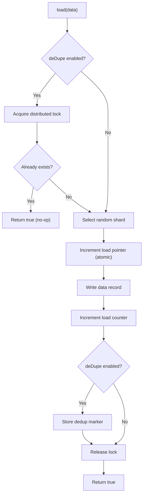
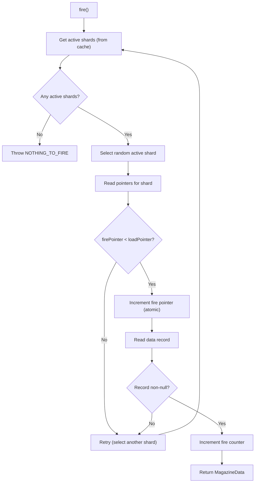

# Aerospike Backend

Use `AerospikeStorage` when your workload needs low-latency, distributed queue operations backed by Aerospike's in-memory key-value store.

## Configuration

```java
AerospikeStorageConfig config = AerospikeStorageConfig.builder()
        .namespace("test")                  // Aerospike namespace
        .dataSetName("magazine_data")       // set name for data records
        .metaSetName("magazine_meta")       // set name for metadata records
        .shards(64)                         // number of shards
        .recordTtl(30 * 24 * 60 * 60)      // data TTL (30 days)
        .metaDataTtl(2 * 30 * 24 * 60 * 60) // metadata TTL (60 days)
        .build();

AerospikeStorage<String> storage = AerospikeStorage.<String>builder()
        .aerospikeClient(aerospikeClient)   // IAerospikeClient instance
        .storageConfig(config)
        .enableDeDupe(true)                 // enable de-duplication
        .farmId("dc1")                      // data centre identifier
        .clazz(String.class)                // data type class
        .clientId("my-service")             // owning service
        .scope(MagazineScope.LOCAL)         // LOCAL or GLOBAL
        .build();
```

| Parameter | Type | Default | Description |
|-----------|------|---------|-------------|
| `aerospikeClient` | `IAerospikeClient` | *(required)* | An already-connected Aerospike client. The library does **not** manage the client lifecycle. |
| `namespace` | `String` | *(required)* | Aerospike namespace. Must already exist on the cluster. |
| `dataSetName` | `String` | *(required)* | Set name for data records. Resolved as `{farmId}_{dataSetName}` for `LOCAL` scope. |
| `metaSetName` | `String` | *(required)* | Set name for metadata records. Resolved as `{farmId}_{metaSetName}` for `LOCAL` scope. |
| `shards` | `int` | `64` | Number of shards in the magazine. |
| `recordTtl` | `int` | `2592000` (30 days) | TTL in seconds for data records. |
| `metaDataTtl` | `int` | `5184000` (60 days) | TTL in seconds for metadata records. |
| `enableDeDupe` | `boolean` | `false` | Enable distributed de-duplication on writes. |
| `farmId` | `String` | *(required)* | Data centre / farm identifier. |
| `clazz` | `Class<T>` | *(required)* | The data type class for casting on read. |
| `clientId` | `String` | *(required)* | Owning service identifier. |
| `scope` | `MagazineScope` | *(required)* | `LOCAL` or `GLOBAL`. |

## How It Works

### Initialization

When a `Magazine` is constructed with `AerospikeStorage`, the constructor validates shard configuration:

1. Reads the existing shard metadata record from Aerospike.
2. If no record exists, writes the configured shard count with a 1-year TTL.
3. If a record exists, validates:
    - Cannot **decrease** shard count.
    - Cannot **convert** unsharded (≤ 1) to sharded (> 1).

### Load Operation



1. If de-duplication is enabled, a distributed lock is acquired via `DistributedLockManager`.
2. If the data already exists (checked via a deduper set), returns `true` without writing.
3. A random shard is selected.
4. The load pointer for that shard is atomically incremented (`Operation.add`).
5. The data is written to the data set with the constructed key.
6. The load counter is atomically incremented.
7. If de-duplication is enabled, a dedup marker is stored.
8. The lock is released in the `finally` block.

### Fire Operation



1. Active shards are fetched from a Caffeine cache (refreshed every 5 seconds).
2. A random active shard is selected.
3. If `firePointer < loadPointer`, the fire pointer is incremented and the data record is read.
4. If the record is null (e.g. expired), the retryer retries with another shard.
5. The fire retryer runs **indefinitely** until a non-null result is found or a `NOTHING_TO_FIRE` exception is thrown.

!!! info "Fire retry behaviour"
    The fire retryer uses `StopStrategies.neverStop()`, but only retries when active shards exist and the record read returns null (e.g. data expired). If there are no active shards, `getActiveShards()` throws `MagazineException` with `NOTHING_TO_FIRE` immediately — no retry occurs.

### Reload Operation

Similar to `load()`, but decrements the fire counter instead of incrementing the load counter.

### Delete Operation

Deletes the data record using the Aerospike key constructed from `MagazineData.createAerospikeKey()`.

### Peek Operation

Batch-reads records for the specified shard/pointer combinations without modifying any counters or pointers.

## Key Structure

### Data Records

```
Key:  {magazineId}_SHARD_{shardIndex}_{pointer}    (sharded)
Key:  {magazineId}_{pointer}                        (unsharded)
Set:  {farmId}_{dataSetName}                        (LOCAL scope)
```

**Bins:**

| Bin | Type | Content |
|-----|------|---------|
| `data` | varies | The stored payload. |
| `modified_at` | `Long` | Timestamp of last modification (epoch millis). |

### Metadata Records — Pointers

```
Key:  {magazineId}_SHARD_{shardIndex}_POINTERS
Set:  {farmId}_{metaSetName}
```

| Bin | Type | Content |
|-----|------|---------|
| `LOAD_POINTER` | `Long` | Current load position for the shard. |
| `FIRE_POINTER` | `Long` | Current fire position for the shard. |

### Metadata Records — Counters

```
Key:  {magazineId}_SHARD_{shardIndex}_COUNTERS
Set:  {farmId}_{metaSetName}
```

| Bin | Type | Content |
|-----|------|---------|
| `LOAD_COUNTER` | `Long` | Total successful loads for the shard. |
| `FIRE_COUNTER` | `Long` | Total successful fires for the shard. |

### Shard Metadata

```
Key:  {magazineId}_SHARDS
Set:  {farmId}_{metaSetName}
```

| Bin | Type | Content |
|-----|------|---------|
| `SHARDS` | `Integer` | Configured shard count. TTL: 1 year. |

### Deduper Records

```
Key:  {magazineId}{data}
Set:  {farmId}_{clientId}_deduper
```

| Bin | Type | Content |
|-----|------|---------|
| `modified_at` | `Long` | Timestamp of dedup marker creation. |

## Active Shards Cache

A Caffeine `AsyncLoadingCache` maintains the list of active shards (shards where `loadCounter > fireCounter` **and** `loadPointer > firePointer`):

| Setting | Value |
|---------|-------|
| Max elements | 1024 |
| Refresh interval | 5 seconds |

The cache is keyed by `magazineIdentifier` and reloads by calling `getMetaData()`.

## Distributed Lock Manager

When de-duplication is enabled, `AerospikeStorage` creates a `DistributedLockManager` (from the [DLM library](https://github.com/PhonePe/DLM)):

| Setting | Value |
|---------|-------|
| Client ID | `"magazine"` |
| Lock mode | `EXCLUSIVE` |
| Lock store | `AerospikeStore` (same namespace, set suffix: `magazine_distributed_lock`) |
| Lock level | `DC` for `LOCAL` scope, `XDC` for `GLOBAL` scope |
| Lock key | `{magazineIdentifier}_{data.toString()}` |

## Retry Behaviour

| Setting | Standard Operations | Fire Operations |
|---------|---------------------|-----------------|
| Retry on | `AerospikeException` | `AerospikeException` or `null` result |
| Max attempts | 5 | Infinite (never stop) — but exits immediately with `NOTHING_TO_FIRE` if no active shards |
| Wait between attempts | 10 ms (fixed) | 10 ms (fixed) |
| Block strategy | Thread sleep | Thread sleep |

## Error Mapping

| Exception Type | Mapped Error Code |
|----------------|-------------------|
| `MagazineException` | Propagated as-is |
| `DLMException` with `LOCK_UNAVAILABLE` | `ACTION_DENIED_PARALLEL_ATTEMPT` |
| `RetryException` | `RETRIES_EXHAUSTED` |
| `ExecutionException` | `CONNECTION_ERROR` |
| All others | `INTERNAL_ERROR` (via `propagate()`) |

