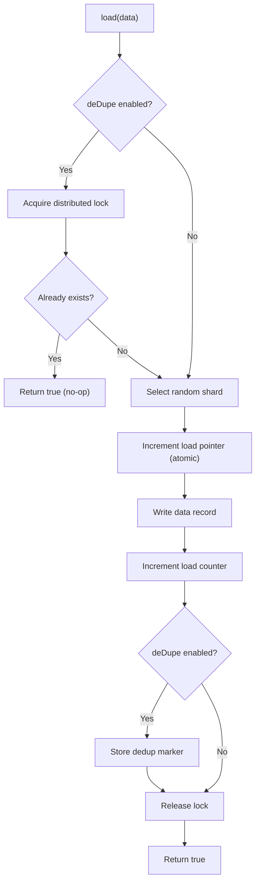
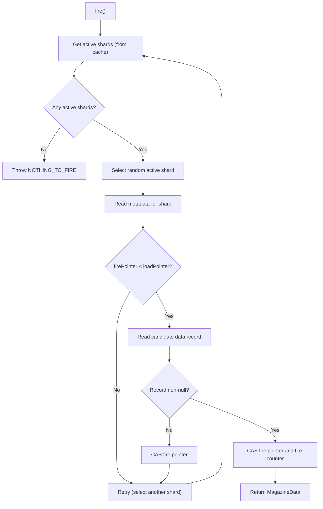

# Aerospike Backend

Use `AerospikeStorage` when your workload needs low-latency, distributed queue operations backed by Aerospike's in-memory key-value store.

## Configuration

```java
AerospikeStorageConfig config = AerospikeStorageConfig.builder()
        .namespace("test")                  // Aerospike namespace
        .dataSetName("magazine_data")       // set name for data records
        .metaSetName("magazine_meta")       // set name for metadata records
        .shards(64)                         // number of shards
        .recordTtl(30 * 24 * 60 * 60)      // data TTL (30 days)
        .metaDataTtl(2 * 30 * 24 * 60 * 60) // metadata TTL (60 days)
        .build();

AerospikeStorage<String> storage = AerospikeStorage.<String>builder()
        .aerospikeClient(aerospikeClient)   // IAerospikeClient instance
        .storageConfig(config)
        .enableDeDupe(true)                 // enable de-duplication
        .farmId("dc1")                      // data centre identifier
        .clazz(String.class)                // data type class
        .clientId("my-service")             // owning service
        .scope(MagazineScope.LOCAL)         // LOCAL or GLOBAL
        .build();
```

| Parameter | Type | Default | Description |
|-----------|------|---------|-------------|
| `aerospikeClient` | `IAerospikeClient` | *(required)* | An already-connected Aerospike client. The library does **not** manage the client lifecycle. |
| `namespace` | `String` | *(required)* | Aerospike namespace. Must already exist on the cluster. |
| `dataSetName` | `String` | *(required)* | Set name for data records. Resolved as `{farmId}_{dataSetName}` for `LOCAL` scope. |
| `metaSetName` | `String` | *(required)* | Set name for metadata records. Resolved as `{farmId}_{metaSetName}` for `LOCAL` scope. |
| `shards` | `int` | `64` | Number of shards in the magazine. |
| `recordTtl` | `int` | `2592000` (30 days) | TTL in seconds for data records. Must be positive. |
| `metaDataTtl` | `int` | `5184000` (60 days) | TTL in seconds for metadata records. Must be greater than `recordTtl`. |
| `enableDeDupe` | `boolean` | `false` | Enable distributed de-duplication on writes. |
| `farmId` | `String` | *(required)* | Data centre / farm identifier. |
| `clazz` | `Class<T>` | *(required)* | The data type class for casting on read. |
| `clientId` | `String` | *(required)* | Owning service identifier. |
| `scope` | `MagazineScope` | *(required)* | `LOCAL` or `GLOBAL`. |

Each `Magazine` resolves its metadata schema version during construction and passes it with the magazine identifier as immutable operation context. A storage instance can therefore be shared without runtime schema reads or cross-magazine routing state.

## How It Works

### Initialization

When a `Magazine` is constructed with `AerospikeStorage`, the constructor validates shard configuration:

1. Reads the existing shard metadata record from Aerospike.
2. If no record exists, creates a version-2 shard record with the configured shard count and a 5-year TTL.
3. If a record exists, the shard count cannot decrease and an unsharded magazine cannot become sharded. Accepted increases are persisted to prevent later clients from reopening the magazine with fewer shards.
4. A missing `META_VERSION` selects the legacy `POINTERS` and `COUNTERS` layout; version 2 selects `METADATA`.

### Load Operation



1. If de-duplication is enabled, a distributed lock is acquired via `DistributedLockManager`.
2. If the data already exists (checked via a deduper set), returns `true` without writing.
3. A random shard is selected.
4. The load pointer for that shard is atomically incremented (`Operation.add`).
5. The data is written to the data set with the constructed key.
6. The load counter is atomically incremented.
7. If de-duplication is enabled, a dedup marker is stored.
8. The lock is released in the `finally` block.

### Fire Operation



1. Active shards are fetched from a Caffeine cache (refreshed every 5 seconds).
2. A random active shard is selected.
3. If `firePointer < loadPointer`, the next candidate data record is read.
4. A write filter conditionally claims the candidate only while `FIRE_POINTER` still equals the observed value. Version-2 records atomically advance both `FIRE_POINTER` and `FIRE_COUNTER`; legacy magazines update the counter record separately. Missing records advance only `FIRE_POINTER`.
5. If another consumer claims the pointer first, the filter rejects the write and the operation retries from fresh metadata. Updates to unrelated metadata bins do not invalidate the claim.
6. Scanning continues while an active shard has unscanned pointers. Once all cached active shards are exhausted, `NOTHING_TO_FIRE` is returned.

!!! info "Fire retry behaviour"
    If there are no active shards, `getActiveShards()` throws `MagazineException` with `NOTHING_TO_FIRE` immediately. Only exhausted shards are removed from the current process-local cached value; a missing record does not imply that its shard is empty.

### Reload Operation

Similar to `load()`, but decrements the fire counter instead of incrementing the load counter.

### Delete Operation

Deletes the data record using the Aerospike key constructed from `MagazineData.createAerospikeKey()`.

### Peek Operation

Batch-reads records for the specified shard/pointer combinations without modifying any counters or pointers.

## Key Structure

### Data Records

```
Key:  {magazineId}_SHARD_{shardIndex}_{pointer}    (sharded)
Key:  {magazineId}_{pointer}                        (unsharded)
Set:  {farmId}_{dataSetName}                        (LOCAL scope)
```

**Bins:**

| Bin | Type | Content |
|-----|------|---------|
| `data` | varies | The stored payload. |
| `modified_at` | `Long` | Timestamp of last modification (epoch millis). |

### Unified Metadata Records

```
Key:  {magazineId}_SHARD_{shardIndex}_METADATA
Set:  {farmId}_{metaSetName}
```

| Bin | Type | Content |
|-----|------|---------|
| `LOAD_POINTER` | `Long` | Current load position for the shard. |
| `FIRE_POINTER` | `Long` | Current fire position for the shard. |
| `LOAD_COUNTER` | `Long` | Total successful loads for the shard. |
| `FIRE_COUNTER` | `Long` | Total successful fires for the shard. |

New magazines use the unified `METADATA` record. Existing magazines whose shard record has no `META_VERSION` remain on the legacy layout and continue using separate `POINTERS` and `COUNTERS` records. Magazine does not migrate persisted metadata internally.

!!! warning "Legacy queues"
    Let short-lived legacy magazines drain on their existing layout. Create a new magazine identifier when a team needs the unified layout immediately. If the `_SHARDS` record is absent, the identifier is treated as a new version-2 magazine; orphaned legacy metadata is not discovered or migrated.

!!! warning "Rolling deployment"
    Existing versionless magazines remain compatible during a rolling deployment. Do not create a new magazine identifier until every running instance uses a version that understands `META_VERSION`; older clients would write legacy metadata for the new identifier.

### Shard Metadata

```
Key:  {magazineId}_SHARDS
Set:  {farmId}_{metaSetName}
```

| Bin | Type | Content |
|-----|------|---------|
| `SHARDS` | `Integer` | Configured shard count. TTL: 5 years. |
| `META_VERSION` | `Integer` | Metadata layout version. |
| `CREATED_AT` | `Long` | Creation time for version-2 magazines. |

### Deduper Records

```
Key:  {magazineId}{data}
Set:  {farmId}_{clientId}_deduper
```

| Bin | Type | Content |
|-----|------|---------|
| `modified_at` | `Long` | Timestamp of dedup marker creation. |

## Active Shards Cache

A Caffeine `AsyncLoadingCache` maintains the list of active shards (shards where `loadCounter > fireCounter` and `loadPointer > firePointer`):

| Setting | Value |
|---------|-------|
| Max elements | 1024 |
| Refresh interval | 5 seconds |

The cache is keyed by immutable magazine context. Version-2 magazines reload with one metadata batch read; legacy magazines retain separate pointer and counter batch reads. The cache is process-local, so data loaded by another application instance can take up to the five-second refresh interval to appear in this instance's active-shard list.

## Distributed Lock Manager

When de-duplication is enabled, `AerospikeStorage` creates a `DistributedLockManager` (from the [DLM library](https://github.com/PhonePe/DLM)):

| Setting | Value |
|---------|-------|
| Client ID | `"magazine"` |
| Lock mode | `EXCLUSIVE` |
| Lock store | `AerospikeStore` (same namespace, set suffix: `magazine_distributed_lock`) |
| Lock level | `DC` for `LOCAL` scope, `XDC` for `GLOBAL` scope |
| Lock key | `{magazineIdentifier}_{data.toString()}` |

## Retry Behaviour

| Setting | Standard Operations | Fire Operations |
|---------|---------------------|-----------------|
| Retry on | `AerospikeException` | `null` result (pointer hole) |
| Max attempts | 5 | Continues while active shards have unscanned pointers |
| Wait between attempts | 10 ms (fixed) | None |
| Block strategy | Thread sleep | None |

The filtered fire-pointer claim is attempted once because an Aerospike timeout can leave the write outcome ambiguous. Retrying it could claim another pointer.

## Error Mapping

| Exception Type | Mapped Error Code |
|----------------|-------------------|
| `MagazineException` | Propagated as-is |
| `DLMException` with `LOCK_UNAVAILABLE` | `ACTION_DENIED_PARALLEL_ATTEMPT` |
| `RetryException` | `RETRIES_EXHAUSTED` |
| `ExecutionException` | `CONNECTION_ERROR` |
| All others | `INTERNAL_ERROR` (via `propagate()`) |
