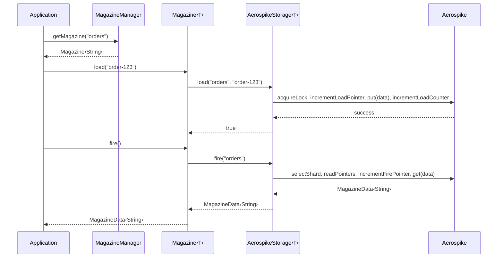
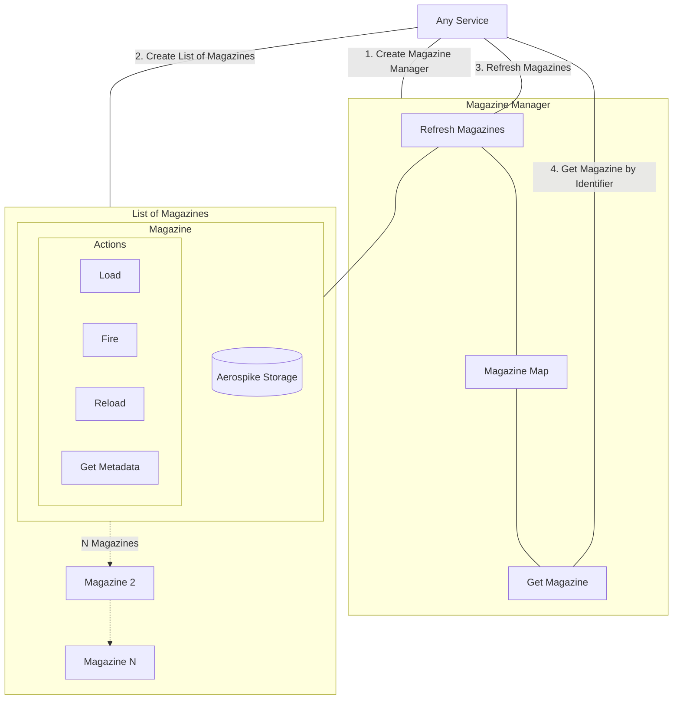

# Magazine

Magazine is a Java library that provides a robust, distributed, persistent queue abstraction for homogeneous data management. It is designed for applications that need to **persist a collection of similar data objects** and **retrieve them on demand**, with built-in support for sharding, de-duplication, and concurrency control.

## Why Magazine?

In many applications, we encounter situations where we need to persist a collection of similar data objects, retrieve and utilise them on demand, and handle concurrent access safely. Magazine provides a single, battle-tested abstraction that handles all of this — so you don't have to roll your own.

Inspired by the mechanics of a rifle magazine, the library offers an intuitive API centred around three core operations:

| Operation | Analogy | Description |
|-----------|---------|-------------|
| **Load** | Insert a round into the magazine | Persist data into the queue |
| **Fire** | Pull the trigger, eject a round | Consume the next item from the queue |
| **Reload** | Re-insert a round | Re-enqueue data without counting it as a new load |

## Key Features

- **Storage abstraction** — Aerospike is currently supported, and the storage contract can be extended with additional implementations.
- **Horizontal scaling via sharding** — configurable shard count (default: 64).
- **Distributed locking** — prevents concurrent duplicate writes when de-duplication is enabled.
- **Automatic retries** — configurable retry policy for transient backend failures.
- **Peek without consuming** — inspect specific shards and pointers without modifying state.
- **Magazine Manager** — orchestrate heterogeneous magazine types in one place.

## How It Works

## Architecture

| Component | Role |
|-----------|------|
| **`MagazineManager`** | Facade for managing multiple `Magazine` instances by identifier. |
| **`Magazine<T>`** | Type-safe wrapper providing `load`, `fire`, `reload`, `delete`, `peek`, `getMetaData`. |
| **`BaseMagazineStorage<T>`** | Abstract storage contract; implemented by each backend. |
| **`AerospikeStorage<T>`** | Production-ready Aerospike backend with sharding, retries, and distributed locks. |
| **`MagazineData<T>`** | Envelope carrying the data payload, fire pointer, shard, and magazine identifier. |
| **`MetaData`** | Per-shard counters (`loadCounter`, `fireCounter`) and pointers (`loadPointer`, `firePointer`). |

## What to Read Next

- [Getting Started](getting-started.md) — dependency setup, prerequisites, building locally.
- [Usage](usage.md) — complete examples for every operation.
- [Concepts](concepts/api-reference.md) — API reference, defaults, error codes.
- [Storage Backend](backends/aerospike.md) — Aerospike configuration and internals.
