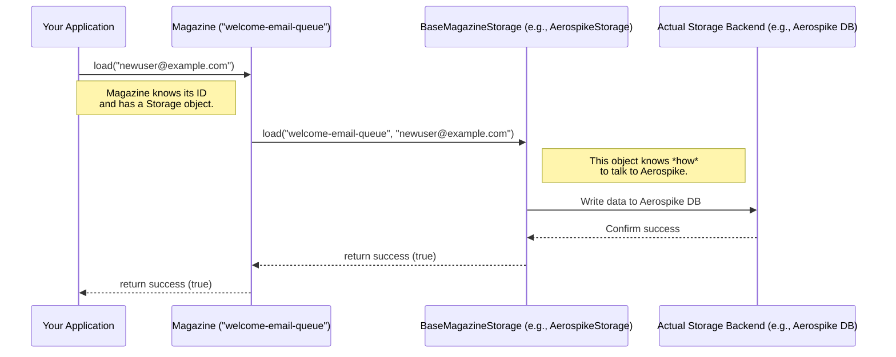

# Chapter 4: BaseMagazineStorage / Storage Strategy

In [Chapter 3: MagazineManager](magazinemanager.md), we saw how the `MagazineManager` acts as a central hub, giving us access to different `Magazine` objects like `"welcome-email-queue"` or `"security-check-queue"`. We learned how to `load` data into a `Magazine` and `fire` it out.

But have you ever wondered: when you call `magazine.load("user@example.com")`, where does that email address *actually* go? Is it stored in memory? Written to a file? Saved in a database? And how does the library remember which item to `fire` next?

This chapter dives into the **engine** that powers the `Magazine`: the `BaseMagazineStorage` and the concept of a Storage Strategy.

## The Problem: Where Does the Data Live?

Think about our `Magazine` object. We saw in [Chapter 1: Magazine](magazine.md) that it's mostly a coordinator. It takes your commands (`load`, `fire`) but doesn't store the data itself long-term. If your application restarts, you wouldn't want to lose all the emails waiting in the queue!

So, the `Magazine` needs a reliable helper to handle the actual saving, retrieving, and managing of data. But we also want flexibility. Maybe today we want to store data super fast in memory for testing, but tomorrow we need to use a powerful database like Aerospike for production because it can handle tons of data and survive crashes.

How can the `Magazine` class work with different storage systems without needing to be rewritten for each one?

## The Solution: A Standardized Blueprint - `BaseMagazineStorage`

The answer is `BaseMagazineStorage`. Think of it like the standardized internal mechanism of any rifle magazine – the spring, the follower, the feed lips.

*   **The Contract:** `BaseMagazineStorage` is an **abstract blueprint** (an `abstract class` in Java). It defines a **contract** – a set of rules and operations that any storage mechanism *must* provide if it wants to work with the `Magazine` library.
*   **Core Operations:** This contract specifies essential functions like:
    *   `load(identifier, data)`: How to store a new item.
    *   `fire(identifier)`: How to retrieve the next available item.
    *   `reload(identifier, data)`: How to put an item back (that was previously loaded).
    *   `getMetaData(identifier)`: How to get information *about* the magazine's state (like how many items are loaded or fired). We'll learn more about this in [Chapter 5: MetaData (Pointers & Counters)](metadata_pointers_counters.md).
    *   `delete(magazineData)`: How to permanently remove an item after it's been processed.
    *   `peek(identifier, pointers)`: How to look at specific items without firing them (useful for debugging or monitoring).
*   **The Strategy:** Each specific way of storing data (like using Aerospike, or maybe a future file-based storage) is called a **Storage Strategy**. Each strategy provides its *own concrete implementation* of the methods defined in the `BaseMagazineStorage` blueprint.

**Analogy:** Imagine a universal remote control (`Magazine`). It has standard buttons like "Play", "Pause", "Stop" (`load`, `fire`, `delete`). `BaseMagazineStorage` is like the *specification* for how any device (TV, DVD player, etc.) must respond to those button presses. A specific TV brand (`AerospikeStorage`) implements the actual actions (show picture, change channel) according to that specification. The remote works with any compliant device because it relies on the standard interface.

## Why Is This Useful? Plug-and-Play Storage!

This "Storage Strategy" approach is powerful because it **decouples** the `Magazine`'s logic from the storage details.

*   **Flexibility:** You can switch the underlying storage system without changing the code that uses the `Magazine` object. Want to move from testing in memory to production with Aerospike? You just configure the `Magazine` to use a different `BaseMagazineStorage` implementation.
*   **Extensibility:** If a new storage technology comes along, someone can write a new class that implements the `BaseMagazineStorage` contract, and it will instantly work with the existing `Magazine` system.
*   **Simplicity:** The `Magazine` class itself stays simple. It doesn't need complex `if/else` statements to handle different databases. It just delegates the work to whichever `BaseMagazineStorage` object it's been given.

## How `Magazine` Uses the Storage Strategy

Let's revisit how `Magazine.load` works, focusing on the interaction with `BaseMagazineStorage`:

1.  When you create a `Magazine` object, you (or the framework you're using) provide it with a specific instance of a class that extends `BaseMagazineStorage` (e.g., an `AerospikeStorage` object).
2.  The `Magazine` object stores a reference to this storage object.
3.  When you call a method like `magazine.load("data")`, the `Magazine` object simply turns around and calls the corresponding method on its storage object: `storage.load(magazineIdentifier, "data")`.



The `Magazine` doesn't care *how* `Storage.load` works internally, only that it fulfills the contract defined by `BaseMagazineStorage`.

## Code Dive: The Blueprint (`BaseMagazineStorage.java`)

Let's look at the definition of the blueprint itself. It's an abstract class, meaning it defines method signatures but doesn't (necessarily) provide the full implementation for all of them. Concrete storage strategies *must* provide these implementations.

--- File: `src/main/java/com/phonepe/magazine/core/BaseMagazineStorage.java` (Simplified) ---

```java
package com.phonepe.magazine.core;

import com.phonepe.magazine.common.MagazineData;
import com.phonepe.magazine.common.MetaData;
// ... other imports ...

// Abstract class - the blueprint for all storage strategies
public abstract class BaseMagazineStorage<T> {

    // Information about the storage (type, TTLs, etc.)
    private final StorageType type;
    private final int recordTtl; // How long data items should live
    private final int metaDataTtl; // How long metadata should live
    // ... other config fields ...

    // Constructor to set up configuration
    protected BaseMagazineStorage(
            final StorageType type, final int recordTtl, final int metaDataTtl, /*... other params ...*/) {
        this.type = type;
        this.recordTtl = recordTtl;
        this.metaDataTtl = metaDataTtl;
        // ... initialize other fields ...
    }

    /**
     * The CONTRACT: Methods that concrete storage classes MUST implement.
     */

    // How to store new data
    public abstract boolean load(final String magazineIdentifier, final T data);

    // How to put data back (after a failed processing attempt, maybe)
    public abstract boolean reload(final String magazineIdentifier, final T data);

    // How to get the next item to process
    public abstract MagazineData<T> fire(final String magazineIdentifier);

    // How to get status info (counts, pointers)
    public abstract Map<String, MetaData> getMetaData(final String magazineIdentifier);

    // How to permanently remove processed data
    public abstract void delete(final MagazineData<T> magazineData);

    // How to look at data without removing it
    public abstract Set<MagazineData<T>> peek(
            final String magazineIdentifier,
            final Map<Integer, Set<Long>> shardPointersMap);

    // Getters for configuration fields (like getRecordTtl(), getType(), etc.)
    // ...
}
```

**Explanation:**

*   **`abstract class BaseMagazineStorage<T>`:** Declares it as a blueprint. The `<T>` means it can work with any data type.
*   **`protected BaseMagazineStorage(...)`:** The constructor takes configuration common to all storage types (like Time-To-Live settings).
*   **`public abstract boolean load(...)`:** The `abstract` keyword means this class only defines the *signature* (name, parameters, return type) of the `load` method. It doesn't say *how* to load. Each concrete storage strategy (like `AerospikeStorage`) must provide the actual code for this.
*   The other `abstract` methods (`reload`, `fire`, `getMetaData`, `delete`, `peek`) similarly define the required operations without implementing them.

## Code Dive: A Concrete Strategy (`AerospikeStorage.java` - Snippet)

Now, let's peek at `AerospikeStorage`, which is a *concrete implementation* of the `BaseMagazineStorage` blueprint. It fills in the details for how to perform the operations using the Aerospike database.

--- File: `src/main/java/com/phonepe/magazine/impl/aerospike/AerospikeStorage.java` (Simplified Snippet) ---

```java
package com.phonepe.magazine.impl.aerospike;

import com.phonepe.magazine.common.MagazineData;
import com.phonepe.magazine.core.BaseMagazineStorage; // Base blueprint
import com.phonepe.magazine.core.StorageType;
// ... many Aerospike specific imports ...

// AerospikeStorage EXTENDS the blueprint and provides concrete implementations
public class AerospikeStorage<T> extends BaseMagazineStorage<T> {

    private final IAerospikeClient aerospikeClient; // Aerospike connection
    private final String namespace; // Aerospike specific config
    private final String dataSetName; // Where data is stored in Aerospike
    // ... other Aerospike related fields and config ...

    // Constructor sets up Aerospike connection and config
    @Builder
    public AerospikeStorage(/*... Aerospike specific params ...*/) {
        super(StorageType.AEROSPIKE, /*... common config ...*/); // Call base constructor
        this.aerospikeClient = /*... setup client ...*/;
        this.namespace = /*... get namespace ...*/;
        // ... initialize other fields ...
    }

    // --- IMPLEMENTATION of the abstract 'load' method ---
    @Override // Indicates we are implementing a method from the base class
    public boolean load(final String magazineIdentifier, final T data) {
        // 1. Validate data type (optional, good practice)
        validateDataType(data);
        try {
            // 2. Maybe acquire a lock for concurrency control (see later chapters)
            // acquireLock(...) 

            // 3. Check if data already exists (if deduplication is enabled)
            // if (alreadyExists(...)) { return true; }

            // 4. Determine where in Aerospike to put it (key, shard)
            Integer selectedShard = selectShard(); // Pick a partition
            long loadPointer = incrementAndGetLoadPointer(magazineIdentifier, selectedShard); // Get next sequence number
            String aerospikeKey = createKey(magazineIdentifier, selectedShard, String.valueOf(loadPointer));

            // 5. Actually write to Aerospike database!
            boolean success = writeToAerospike(aerospikeKey, data); // Simplified call

            // 6. Update counters (if needed)
            if (success) {
                incrementLoadCounter(magazineIdentifier, selectedShard);
            }

            // 7. Maybe store info for deduplication check later
            // storeDataForDeDupe(...)

            return success;
        } catch (Exception e) {
            // Handle Aerospike errors (connection issues, etc.)
            throw handleException(e, "Error loading data", magazineIdentifier, null);
        } finally {
            // Release any locks acquired
            // releaseLock(...)
        }
    }

    // --- Implementations for fire(), reload(), delete(), getMetaData(), peek() also exist ---
    // ... using aerospikeClient.get(...), aerospikeClient.operate(...), etc. ...

    private boolean writeToAerospike(String key, T data) {
        // Simplified: Actual code uses aerospikeClient.put(...)
        System.out.println(" Pretending to write key '" + key + "' with data '" + data + "' to Aerospike.");
        return true;
    }

    // ... other private helper methods for Aerospike specifics ...
}
```

**Explanation:**

*   **`extends BaseMagazineStorage<T>`:** This line declares that `AerospikeStorage` *is a* specific type of `BaseMagazineStorage`. It promises to provide implementations for all the abstract methods.
*   **`@Override public boolean load(...)`:** The `@Override` annotation confirms we're implementing the `load` method from the blueprint. The actual code inside this method contains logic specific to interacting with Aerospike (calculating keys, using `aerospikeClient`, handling Aerospike exceptions).
*   **Other Methods:** Similarly, `AerospikeStorage` provides concrete code for `fire`, `reload`, `delete`, etc., all using Aerospike-specific commands.
*   **HBaseStorage:** The library also includes `HBaseStorage.java`, which does the same thing but using HBase commands (though it's currently less implemented).

## Conclusion

You've now uncovered the secret engine behind the `Magazine`: the `BaseMagazineStorage` abstract class. It acts as a crucial blueprint, defining the standard operations (`load`, `fire`, `delete`, etc.) required for any storage system to work with the `Magazine` library. Concrete implementations like `AerospikeStorage` provide the specific details for *how* to perform these operations using a particular backend (like Aerospike).

This design principle (separating the interface/contract from the implementation) makes the library flexible and extensible, allowing you to plug in different storage strategies as needed.

But how does the storage strategy keep track of which item to `fire` next? How does it know how many items have been loaded versus fired? It uses internal counters and pointers, collectively known as `MetaData`.

Let's explore how these crucial pieces of information are managed in the next chapter: [Chapter 5: MetaData (Pointers & Counters)](metadata_pointers_counters.md).