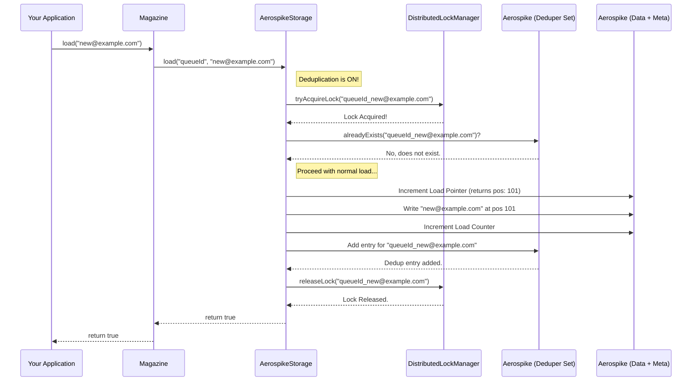

# Chapter 6: Concurrency Control & Deduplication

In [Chapter 5: MetaData (Pointers & Counters)](metadata_pointers_counters.md), we saw how the storage layer uses pointers (`loadPointer`, `firePointer`) and counters (`loadCounter`, `fireCounter`) to keep track of the magazine's state. These are essential for knowing where to load the next item and which item to fire.

But what happens in a busy application where multiple things might be happening at once?

## The Problem: Sharing is Hard!

Imagine our `"welcome-email-queue"` magazine is being used by several parts of our application simultaneously:

1.  **Multiple Sign-up Servers:** Two different web servers handle new user sign-ups. What if *both* try to `load` the *exact same* email address ("concurrent.user@example.com") into the magazine at the precise same moment? Should we end up with two identical tasks in the queue?
2.  **Multiple Worker Processes:** We have several background workers trying to `fire` emails from the queue to send them. What if *two workers* try to `fire` the *very next* available email at the same instant? Could they both get the *same* email, leading to it being sent twice? Or could they mess up the `firePointer`?

These scenarios highlight two common challenges in systems that share resources:

*   **Concurrency Control:** How do we manage simultaneous access to the same magazine (or even the same data item) safely, preventing corruption or unexpected behavior?
*   **Deduplication:** How can we optionally prevent the same piece of data from being loaded multiple times if we only want one instance of it in the queue?

The `magazine` library, particularly when using the `AerospikeStorage` strategy, provides mechanisms to handle these issues.

## Key Concepts Explained

### 1. Concurrency Control: The Traffic Lights

When multiple processes try to modify the same resource (like updating the `loadPointer` or checking if an item exists), they can interfere with each other. This is called a **race condition**.

**Analogy:** Think of a busy intersection without traffic lights. Cars arriving from different directions might crash or get stuck. Concurrency control is like installing traffic lights. It ensures that only one "car" (operation) proceeds through a critical section at a time, preventing collisions.

In the `magazine` library, this is primarily achieved using **locking**. Before performing a sensitive operation (like loading with deduplication enabled), the system tries to acquire a "lock".

### 2. DistributedLockManager [[DLM]](https://github.com/PhonePe/DLM): The Master Key Holder

Since your application might be running across multiple servers (a distributed system), a simple lock within one server isn't enough. We need a way to coordinate across all servers. This is where a **Distributed Lock Manager (DLM)** comes in.

**Analogy:** Imagine a shared resource, like a single microphone on a stage. The DLM is like the stage manager holding the *only* key (the lock) to turn the microphone on. Only the speaker who gets the key from the manager can use the microphone. Once they are done, they return the key, allowing the next speaker to acquire it.

The `AerospikeStorage` uses an internal `DistributedLockManager` component (from a separate `dlm` library) that leverages Aerospike itself to manage these locks across different application instances. When `AerospikeStorage` needs to perform an operation that requires exclusive access (especially related to deduplication), it asks the DLM for a lock associated with the specific data item. If it gets the lock, it proceeds; otherwise, it might wait or report an error (like "someone else is working on this exact item right now").

### 3. Deduplication: Checking the Shelf

Sometimes, you want to ensure that a specific piece of data exists *at most once* in your magazine. For example, you probably only want to send one welcome email to "new.user@example.com", even if the sign-up event accidentally gets triggered twice.

**Analogy:** Imagine adding books to a library shelf. Deduplication is like checking the shelf first: "Do we already have 'The Great Gatsby' by F. Scott Fitzgerald?" If yes, you don't add another copy. If no, you add it.

`AerospikeStorage` offers an optional deduplication feature. When you configure the storage, you can set a flag `enableDeDupe` to `true`. If enabled, before loading a new item, `AerospikeStorage` will:

1.  Acquire a lock for that specific data item (using the DLM).
2.  Check if an identical item already exists in a special "deduper" set within Aerospike.
3.  If it doesn't exist, it proceeds to load the item normally (add it to the main data set, update pointers/counters) *and* adds an entry to the deduper set.
4.  If it *does* already exist in the deduper set, it skips the loading step entirely but still returns `true` (or doesn't throw an error), effectively saying "Yes, this item is considered loaded (or already was)".
5.  Release the lock.

This ensures that even if `load("new.user@example.com")` is called multiple times concurrently, only one instance of that email will actually be stored and tracked for deduplication purposes.

**Important Note:** Deduplication relies on the `toString()` representation of your data object to check for duplicates. It works best with simple types like `String`, `Integer`, `Long`. For complex custom objects, you need to ensure their `toString()` method produces a unique and consistent representation for identical objects.

## Using Deduplication

Concurrency control via locking is mostly handled *automatically* by `AerospikeStorage` when needed (especially when deduplication is on). You don't typically interact with the DLM directly.

However, you *do* need to explicitly enable deduplication when setting up your `AerospikeStorage`.

Let's imagine the setup code (simplified) where you configure the storage strategy:

```java
// Assume you have an Aerospike client connection
IAerospikeClient aerospikeClient = connectToAerospike(); 

// Configuration for Aerospike storage
AerospikeStorageConfig storageConfig = AerospikeStorageConfig.builder()
    .namespace("my_app_namespace")
    .dataSetName("email_queue_data")
    .metaSetName("email_queue_meta")
    .recordTtl(3600) // Data TTL in seconds (1 hour)
    .metaDataTtl(86400) // Metadata TTL (1 day)
    .shards(1) // Start with 1 shard (no sharding yet)
    .build();

// === Enable Deduplication Here ===
boolean useDeduplication = true; 

// Create the storage instance for String data
AerospikeStorage<String> emailStorage = AerospikeStorage.<String>builder()
    .aerospikeClient(aerospikeClient)
    .storageConfig(storageConfig)
    .enableDeDupe(useDeduplication) // <-- Set the flag!
    .clazz(String.class) // Type of data
    .clientId("worker-app-1") // Your application's client ID
    .farmId("production") // Environment identifier
    .scope(MagazineScope.GLOBAL) // Scope of the magazine
    .build();

log.info("AerospikeStorage created with Deduplication: " + emailStorage.isEnableDeDupe()); 

// Now, when you create a Magazine using this storage, deduplication will be active.
// Magazine<String> emailMagazine = new Magazine<>("welcome-email-queue", emailStorage); 
```

**Explanation:**

1.  We configure various Aerospike settings (namespace, set names, TTLs) in `AerospikeStorageConfig`.
2.  We create an `AerospikeStorage` instance using its builder.
3.  Crucially, we call `.enableDeDupe(true)` to turn on the deduplication feature for this storage instance.
4.  Any `Magazine` created using this `emailStorage` object will now benefit from deduplication during `load` operations.

**What happens when you load now?**

```java
// Assume emailMagazine uses the storage configured above with enableDeDupe=true
Magazine<String> emailMagazine = /* ... created with emailStorage ... */;

// First time loading this email
boolean loaded1 = emailMagazine.load("duplicate.test@example.com"); 
log.info("First load attempt: " + loaded1); // Output: First load attempt: true

// Try loading the exact same email again
boolean loaded2 = emailMagazine.load("duplicate.test@example.com"); 
log.info("Second load attempt: " + loaded2); // Output: Second load attempt: true 
```

**Explanation:**

Even though the second `load` call also returns `true`, internally, `AerospikeStorage` recognized that `"duplicate.test@example.com"` was already present (due to the first load and the entry in the deduper set). It acquired a lock, checked for existence, found it, released the lock, and skipped adding it again to the main data set. The `loadPointer` and `loadCounter` were likely only incremented during the *first* successful load of this specific item.

## How It Works Internally: Locks and Checks

Let's visualize the `load` operation when deduplication is enabled.

**Sequence Diagram for `load` with Deduplication:**



**Code Snippets (Simplified from `AerospikeStorage.java`)**

Inside the `load` method of `AerospikeStorage`:

```java
// File: src/main/java/com/phonepe/magazine/impl/aerospike/AerospikeStorage.java (Simplified Load Logic)

@Override
public boolean load(final String magazineIdentifier, final T data) {
    validateDataType(data); // Check if data type matches magazine type

    // Create a lock instance specific to this magazine + data item
    final Lock lock = lockManager.getLockInstance(
            String.join("_", magazineIdentifier, data.toString()), // Lock ID based on magazine & data
            lockLevel); // Lock scope (e.g., GLOBAL)
    try {
        // --- Concurrency Control ---
        if (isEnableDeDupe()) {
            // Attempt to acquire the distributed lock. Fails if unavailable.
            lockManager.tryAcquireLock(lock); 
            log.debug("DEBUG: Acquired lock for: " + lock.getLockId());
        }

        // --- Deduplication Check ---
        // Check if item already exists ONLY if dedupe is enabled
        boolean proceedToLoad = !isEnableDeDupe() || !alreadyExists(magazineIdentifier, data);
        
        if (proceedToLoad) {
            log.debug("DEBUG: Item does not exist (or dedupe off). Proceeding to load.");
            // --- Actual Loading Logic ---
            final Integer selectedShard = selectShard(); // Choose a partition
            // Get next position, increments pointer atomically
            final long loadPointer = incrementAndGetLoadPointer(magazineIdentifier, selectedShard); 
            final String key = createKey(magazineIdentifier, selectedShard, String.valueOf(loadPointer));
            
            // Write data to Aerospike's main data set
            final boolean success = loadData(key, data); 
            
            if (success) {
                // Increment total load counter atomically
                incrementLoadCounter(magazineIdentifier, selectedShard); 
            }

            // --- Update Deduper Set ---
            if (isEnableDeDupe()) {
                 // Add an entry to the deduper set to mark this data as seen
                storeDataForDeDupe(magazineIdentifier, data);
                log.debug("DEBUG: Stored dedupe entry for: " + data.toString());
            }
            return success; // Return true if data write was successful
        } else {
             // Item already exists (and dedupe is enabled)
             log.debug("DEBUG: Item already exists. Skipping load. Returning true.");
             return true; // Indicate success as the item is effectively 'loaded'
        }
    } catch (Exception e) {
        // Handle errors (e.g., lock unavailable, Aerospike connection issue)
        throw handleException(e, "Error loading data", magazineIdentifier, lock);
    } finally {
        // --- Release Lock ---
        // ALWAYS release the lock in a finally block to prevent deadlocks
        // This call is safe even if the lock wasn't acquired (e.g., if dedupe is off)
        lockManager.releaseLock(lock); 
        log.debug("DEBUG: Released lock (if held) for: " + (lock != null ? lock.getLockId() : "null"));
    }
}

// Helper method to check existence in the deduper set
private boolean alreadyExists(final String magazineIdentifier, final T data) {
    // Simplified: Builds a key based on magazineId + data.toString()
    Key deduperKey = buildDeDuperKey(magazineIdentifier, data); 
    // Checks if this key exists in the dedicated deduper Aerospike set
    boolean exists = aerospikeClient.exists(null, deduperKey); 
    log.debug("DEBUG: Checking existence for " + deduperKey.userKey + ": " + exists);
    return exists;
    // Real implementation includes retry logic
}

// Helper method to store entry in the deduper set
private void storeDataForDeDupe(final String magazineIdentifier, final T data) {
    // Simplified: Builds the deduper key
    Key deduperKey = buildDeDuperKey(magazineIdentifier, data);
    // Writes a minimal record (e.g., just a timestamp) to the deduper set
    // with the same TTL as the main data record.
    WritePolicy wp = new WritePolicy();
    wp.expiration = getRecordTtl(); // Use data record TTL
    aerospikeClient.put(wp, deduperKey, new Bin("ts", System.currentTimeMillis()));
    // Real implementation includes retry logic
}
```

**Explanation:**

1.  **Lock Acquisition:** If `enableDeDupe` is true, `lockManager.tryAcquireLock(lock)` is called. The lock ID uniquely identifies the magazine and the specific data item being loaded. This prevents other threads/servers from simultaneously checking or loading the *exact same* data item.
2.  **Existence Check:** The `!isEnableDeDupe() || !alreadyExists(...)` condition cleverly handles both cases:
    *   If dedupe is *off*, `!isEnableDeDupe()` is true, so the `alreadyExists` check is skipped, and `proceedToLoad` becomes true.
    *   If dedupe is *on*, `!isEnableDeDupe()` is false, so `!alreadyExists(...)` is evaluated. If the item *doesn't* exist (`alreadyExists` is false), then `!false` is true, and `proceedToLoad` becomes true. If the item *does* exist, `!true` is false, and `proceedToLoad` becomes false.
3.  **Conditional Load:** The actual loading logic (incrementing pointers/counters, writing data using `loadData`, storing dedupe entry) only happens if `proceedToLoad` is true.
4.  **Return Value:** If loading is skipped because the item already exists, the method still returns `true`.
5.  **Lock Release:** The `lockManager.releaseLock(lock)` is crucial and placed in a `finally` block. This guarantees that the lock is released even if errors occur during the loading process, preventing other processes from being blocked indefinitely.

Concurrency for `fire` operations is handled differently, often relying on the atomic nature of pointer increments in Aerospike (as seen in [Chapter 5: MetaData (Pointers & Counters)](metadata_pointers_counters.md)) rather than explicit data-item locks, ensuring that multiple workers trying to `fire` will reliably get different items.

## Conclusion

You've now learned how the `magazine` library (specifically `AerospikeStorage`) addresses the challenges of simultaneous access and potential data duplication.

*   **Concurrency Control:** It uses a `DistributedLockManager` (DLM) internally to acquire locks, particularly before performing checks related to deduplication, ensuring that operations on the same data item don't interfere with each other across different servers or threads.
*   **Deduplication:** By setting `enableDeDupe` to `true` during storage configuration, you can prevent identical items from being loaded multiple times. The storage layer handles checking for existence and updating a separate tracking set, all protected by locks.

These features make the `Magazine` more robust and predictable, especially in high-throughput, distributed environments.

So far, we've mostly considered a magazine as a single unit. But what if your magazine becomes extremely large, handling millions of items? Processing it as one giant queue might become inefficient. How can we split a magazine into smaller, more manageable parts?

Let's explore this technique in the next chapter: [Chapter 7: Sharding](sharding.md).