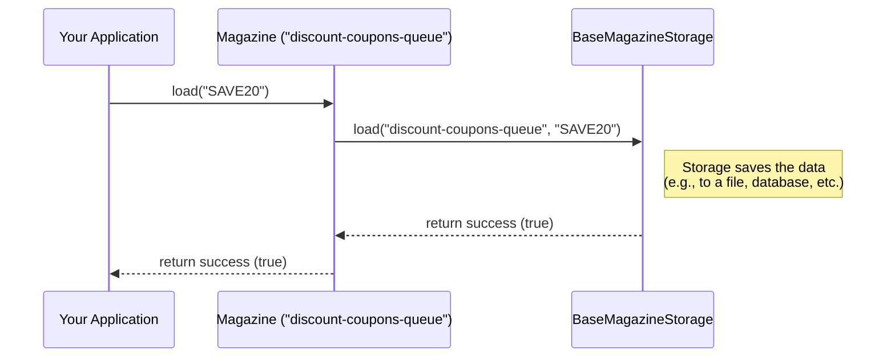

# Chapter 1: Magazine

This library helps you manage collections of data in your applications in a distributed persistent queue fashion. Think of situations where you need to hold onto some information, process it afterwards.

Let's start with a simple story. Imagine you're building a system that needs to distribute discount coupons to users. any merchant wants to distribute coupons via PhonePe to the users. Once the user fulfils the targeting criteria, we want to grant the merchant's coupon to the user. But the available coupons are limited and exclusive to the merchant. 
This is where magazine library comes in handy, here merchant can load the coupons in magazine (or keep on loading), and usersq firing the magazine whenever the criteria is fulfilled (criteria handling feature is not provided by magazine). 

## What is a Magazine?

At its heart, a `Magazine` is like a **container** or a **box** designed specifically for holding data items. The name comes from the analogy of a rifle magazine:

*   You **`load`** items into it, usually one by one.
*   When you need an item, you **`fire`** it out. Typically, the first item you loaded is the first one to come out (this is often called "First-In, First-Out" or FIFO).
*   Sometimes, you might need to put an item back in, which we call **`reload`**.

Here are the key ideas about a `Magazine`:

1.  **Homogeneous Data:** Each magazine is designed to hold only **one specific type** of data. For example, one magazine might hold only text (`String`), while another holds only numbers (`Integer`). You can't mix text and numbers in the same magazine. This keeps things organized and predictable.
2.  **Temporary Storage:** The data isn't meant to live in the magazine forever. It's for short-term use. The library uses an underlying storage system ([BaseMagazineStorage / Storage Strategy](base_magazine_storage__storage_strategy.md)) to actually save the data reliably, even if your application restarts.
3.  **Unique Identity:** Every magazine needs a unique name, called the `magazineIdentifier`. This is how you tell the library *which* specific magazine you want to work with, especially if you have many different magazines.

## Using a Magazine: A Simple Example

Let's revisit our coupon example. We need a place to store the coupon codes that need to be sent to users. We can use a Magazine that holds String data (the coupon codes).

First, you usually interact with magazines through a helper called the `MagazineManager`. Think of the manager as the person who knows where all the different magazines are kept. You ask the manager for the specific magazine you need.

**(Note:** The setup of the `MagazineManager` itself is covered in the [MagazineManager](magazinemanager.md) chapter. For now, assume we have one called `magazineManager` ready to use.)

Let's say our magazine for coupons is identified by the name `discount-coupons-queue`

### Loading Data

When a new coupon is generated, we need to load this coupon code into our magazine.

```java
// Assume magazineManager is already created and configured
MagazineManager magazineManager = ... ;

// Specify the ID and the type of data (String) for our magazine
String magazineId = "discount-coupons-queue";
Class<String> dataType = String.class;

// Data to load
String couponCode = "SAVE20";

// Get the specific magazine and load the data
try {
boolean loaded = magazineManager.getMagazine(magazineId, dataType).load(couponCode);
  if (loaded) {
      System.out.println("Successfully loaded coupon: " + couponCode);
  } else {
      System.out.println("Failed to load coupon: " + couponCode);
  }
} catch (Exception e) {
    System.err.println("Error loading data: " + e.getMessage());
    // Handle potential errors during loading
}
```

**Explanation:**

1.  We define the `magazineId` (`discount-coupons-queue`) and the `dataType` (`String.class`).
2.  We have the actual data (`couponCode`).
3.  We use `magazineManager.getMagazine(magazineId)` to get a reference to our specific magazine.
4.  We then call the `.load(couponCode)` method on that magazine object.
5.  The `load` method attempts to store the coupon code and returns `true` if successful, `false` otherwise. We also wrap it in a `try-catch` block because things might go wrong (like the storage system being temporarily unavailable).

### Firing Data

LLater, a separate part of our application (maybe a background worker) needs to fetch a coupon code from the queue to send it to a user. It uses the `fire` method.

```java
// Assume magazineManager is available
// String magazineId = "discount-coupons-queue";
// Class<String> dataType = String.class;

try {
// Get the magazine and fire one item
    MagazineData<String> firedData = magazineManager.getMagazine(magazineId, dataType).fire();
    
    // The actual data is inside the MagazineData object
    String couponToSend = firedData.getData();
      System.out.println("Fired coupon to send: " + couponToSend);
    
    // Now, try sending the coupon...
    // sendCoupon(couponToSend);
    
    // Important: After successfully processing we can delete the item
    // magazineManager.getMagazine(magazineId, dataType).delete(firedData);

} catch (NoSuchElementException e) {
    System.out.println("No coupons currently in the queue.");
    // This is normal if the magazine is empty
} catch (Exception e) {
    System.err.println("Error firing data: " + e.getMessage());
    // Handle other potential errors
}
```

**Explanation:**

1.  We again get our specific magazine using `magazineManager.getMagazine(...)`.
2.  We call the `.fire()` method. This tries to retrieve the oldest available item.
3.  If successful, `fire()` returns a [MagazineData](magazinedata.md) object. This object wraps our actual data (the coupon code) along with some extra information we'll discuss in the next chapter. We get the coupon code using `firedData.getData()`.
4.  If the magazine is empty, `fire()` might throw an exception (like `NoSuchElementException` depending on the underlying storage).
5.  **Crucially**, after you successfully process the fired item (e.g., after the coupon code is applied successfully), you can explicitly `delete` it from the storage. We'll cover `delete` more later, but it ensures the item isn't processed again accidentally.

### Reloading Data

What if sending the coupon failed temporarily (e.g., the user’s server was down)? We don't want to lose the task. We can use reload to put the coupon code back into the magazine, usually at the end of the queue, to be tried again later.

```java
// Assume magazineManager is available
// String magazineId = "discount-coupons-queue";
// String couponToReload = "SAVE20"; // From a previous failed attempt

try {
    // Get the magazine and reload the data
    boolean reloaded = magazineManager.getMagazine(magazineId).reload(couponToReload);
    if (reloaded) {
        log.info("Successfully reloaded coupon: " + couponToReload);
    } else {
        log.info("Failed to reload coupon: " + couponToReload);
    }
} catch (Exception e) {
    log.error("Error reloading data: " + e.getMessage());
    // Handle potential errors
}
```

**Explanation:**

1.  Similar to `load`, we get the magazine and call `.reload(couponToReload)`.
2.  This adds the item back into the magazine, typically at the end, allowing it to be `fire`d again later. It's specifically designed for cases where an item was already `load`ed once but needs to be put back in circulation.

## How Does it Work Internally? (A Quick Peek)

You might wonder, "Where does the data actually go when I call `load`?" The `Magazine` object itself is quite simple. It acts mostly as a **coordinator**.

When you call a method like `load`, `fire`, or `reload` on a `Magazine` object, the `Magazine` object **delegates** the actual work to the underlying storage system configured for it. This storage system is represented by an object based on [BaseMagazineStorage / Storage Strategy](base_magazine_storage__storage_strategy.md).

Here's a simplified view of what happens when you call `magazine.load("data")`:



The `Magazine` class (`src/main/java/com/phonepe/magazine/Magazine.java`) mainly holds:

1.  The `magazineIdentifier` (like ``discount-coupons-queue``).
2.  A reference to the `baseMagazineStorage` object responsible for handling the actual data persistence.

Let's look at the `load` method inside the `Magazine.java` code:

```java
// Inside src/main/java/com/phonepe/magazine/Magazine.java

public class Magazine<T> {

    private final AerospikeStorage<T> aerospikeStorage; // The storage strategy
    private final String magazineIdentifier;                  // The unique name

    // Constructor sets these up...

    /**
     * Load data into the specified magazine.
     */
    public boolean load(final T data) {
        // Simply pass the call to the storage object!
        return aerospikeStorage.load(magazineIdentifier, data); 
    }

    // ... other methods like fire(), reload() also delegate ...
}
```

As you can see, the `Magazine.load` method just calls the `load` method on the `baseMagazineStorage` object, passing along the `magazineIdentifier` and the `data`. The `fire`, `reload`, and `getMetaData` methods work similarly by delegating to the corresponding methods in the storage layer.

This design makes the `Magazine` class itself quite straightforward, while the complexity of actually saving and retrieving data is handled by the specific [BaseMagazineStorage / Storage Strategy](base_magazine_storage__storage_strategy.md) implementation you choose (like storing data in memory, files, or a database like Aerospike).

## Conclusion

Module defines the core concept of a `Magazine`: a container, homogeneous data items, identified by a unique name. You saw how to use the basic operations (`load`, `fire`, `reload`) through the `MagazineManager` to add data, retrieve it (usually FIFO), and put it back if needed. You also got a glimpse under the hood, understanding that the `Magazine` object delegates the hard work of persistence to an underlying storage strategy.

In the next chapter, we'll look closer at the `MagazineData` object that gets returned when you `fire` an item. It contains more than just your raw data!

Ready to dive deeper? Let's go to [Chapter 2: MagazineData](magazinedata.md).

---