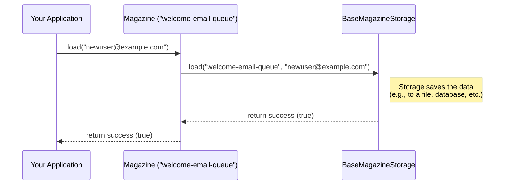

# Chapter 1: Magazine

This library helps you manage collections of temporary data in your applications. Think of situations where you need to hold onto some information for a short while, process it, and then maybe get rid of it.

Let's start with a simple story. Imagine you're building a system that needs to process user notifications. Maybe you want to send a welcome email shortly after a user signs up. You don't want to send it *immediately* in the sign-up process (what if sending fails?), but you need to remember to send it soon. You need a temporary place to store the "send email to user X" task. This is where the `Magazine` concept comes in handy!

## What is a Magazine?

At its heart, a `Magazine` is like a **container** or a **box** designed specifically for holding temporary data items. The name comes from the analogy of a rifle magazine:

*   You **`load`** items (like bullets, or in our case, data) into it, usually one by one.
*   When you need an item, you **`fire`** it out. Typically, the first item you loaded is the first one to come out (this is often called "First-In, First-Out" or FIFO).
*   Sometimes, you might need to put an item back in, which we call **`reload`**.

Here are the key ideas about a `Magazine`:

1.  **Homogeneous Data:** Each magazine is designed to hold only **one specific type** of data. For example, one magazine might hold only text (`String`), while another holds only numbers (`Integer`). You can't mix text and numbers in the same magazine. This keeps things organized and predictable.
2.  **Temporary Storage:** The data isn't meant to live in the magazine forever. It's for short-term use. The library uses an underlying storage system ([BaseMagazineStorage / Storage Strategy](base_magazine_storage__storage_strategy.md)) to actually save the data reliably, even if your application restarts.
3.  **Unique Identity:** Every magazine needs a unique name, called the `magazineIdentifier`. This is how you tell the library *which* specific magazine you want to work with, especially if you have many different magazines (e.g., one for email tasks, one for processing user uploads, etc.).

## Using a Magazine: A Simple Example

Let's revisit our notification example. We need a place to temporarily store the email addresses of users who need a welcome email. We can use a `Magazine` that holds `String` data (the email addresses).

First, you usually interact with magazines through a helper called the `MagazineManager`. Think of the manager as the person who knows where all the different magazines are kept. You ask the manager for the specific magazine you need.

**(Note:** The setup of the `MagazineManager` itself is covered in the [MagazineManager](magazinemanager.md) chapter. For now, assume we have one called `magazineManager` ready to use.)

Let's say our magazine for welcome emails is identified by the name `"welcome-email-queue"`.

### Loading Data

When a new user signs up with the email "newuser@example.com", we need to `load` this email address into our magazine.

```java
// Assume magazineManager is already created and configured
MagazineManager magazineManager = ... ; 

// Specify the ID and the type of data (String) for our magazine
String magazineId = "welcome-email-queue";
Class<String> dataType = String.class;

// Data to load
String emailAddress = "newuser@example.com";

// Get the specific magazine and load the data
try {
  boolean loaded = magazineManager.getMagazine(magazineId, dataType).load(emailAddress);
  if (loaded) {
    System.out.println("Successfully loaded email: " + emailAddress); 
  } else {
    System.out.println("Failed to load email: " + emailAddress);
  }
} catch (Exception e) {
  System.err.println("Error loading data: " + e.getMessage());
  // Handle potential errors during loading
}
```

**Explanation:**

1.  We define the `magazineId` (`"welcome-email-queue"`) and the `dataType` (`String.class`).
2.  We have the actual data (`emailAddress`).
3.  We use `magazineManager.getMagazine(magazineId, dataType)` to get a reference to our specific magazine.
4.  We then call the `.load(emailAddress)` method on that magazine object.
5.  The `load` method attempts to store the email address and returns `true` if successful, `false` otherwise. We also wrap it in a `try-catch` block because things might go wrong (like the storage system being temporarily unavailable).

### Firing Data

Later, a separate part of our application (maybe a background worker) needs to fetch an email address from the queue to actually send the welcome message. It uses the `fire` method.

```java
// Assume magazineManager is available
// String magazineId = "welcome-email-queue";
// Class<String> dataType = String.class;

try {
  // Get the magazine and fire one item
  MagazineData<String> firedData = magazineManager.getMagazine(magazineId, dataType).fire();

  // The actual data is inside the MagazineData object
  String emailToSend = firedData.getData(); 
  System.out.println("Fired email to send: " + emailToSend);

  // Now, try sending the email...
  // sendEmail(emailToSend); 

  // Important: After successfully processing, delete the item
  // magazineManager.getMagazine(magazineId, dataType).delete(firedData);

} catch (NoSuchElementException e) {
  System.out.println("No emails currently in the queue.");
  // This is normal if the magazine is empty
} catch (Exception e) {
  System.err.println("Error firing data: " + e.getMessage());
  // Handle other potential errors
}
```

**Explanation:**

1.  We again get our specific magazine using `magazineManager.getMagazine(...)`.
2.  We call the `.fire()` method. This tries to retrieve the oldest available item.
3.  If successful, `fire()` returns a [MagazineData](magazinedata.md) object. This object wraps our actual data (the email address) along with some extra information we'll discuss in the next chapter. We get the email using `firedData.getData()`.
4.  If the magazine is empty, `fire()` might throw an exception (like `NoSuchElementException` depending on the underlying storage), so we need a `try-catch` block.
5.  **Crucially**, after you successfully process the fired item (e.g., after the email is sent), you usually need to explicitly `delete` it from the storage. We'll cover `delete` more later, but it ensures the item isn't processed again accidentally.

### Reloading Data

What if sending the email failed temporarily (e.g., the email server was down)? We don't want to lose the task. We can use `reload` to put the email address back into the magazine, usually at the end of the queue, to be tried again later.

```java
// Assume magazineManager is available
// String magazineId = "welcome-email-queue";
// Class<String> dataType = String.class;
// String emailToReload = "faileduser@example.com"; // From a previous failed attempt

try {
  // Get the magazine and reload the data
  boolean reloaded = magazineManager.getMagazine(magazineId, dataType).reload(emailToReload);
  if (reloaded) {
    System.out.println("Successfully reloaded email: " + emailToReload);
  } else {
    System.out.println("Failed to reload email: " + emailToReload);
  }
} catch (Exception e) {
  System.err.println("Error reloading data: " + e.getMessage());
  // Handle potential errors
}
```

**Explanation:**

1.  Similar to `load`, we get the magazine and call `.reload(emailToReload)`.
2.  This adds the item back into the magazine, typically at the end, allowing it to be `fire`d again later. It's specifically designed for cases where an item was already `load`ed once but needs to be put back in circulation.

## How Does it Work Internally? (A Quick Peek)

You might wonder, "Where does the data actually go when I call `load`?" The `Magazine` object itself is quite simple. It acts mostly as a **coordinator**.

When you call a method like `load`, `fire`, or `reload` on a `Magazine` object, the `Magazine` object **delegates** the actual work to the underlying storage system configured for it. This storage system is represented by an object based on [BaseMagazineStorage / Storage Strategy](base_magazine_storage__storage_strategy.md).

Here's a simplified view of what happens when you call `magazine.load("data")`:



The `Magazine` class (`src/main/java/com/phonepe/magazine/Magazine.java`) mainly holds:

1.  The `magazineIdentifier` (like `"welcome-email-queue"`).
2.  A reference to the `baseMagazineStorage` object responsible for handling the actual data persistence.

Let's look at the `load` method inside the `Magazine.java` code:

```java
// Inside src/main/java/com/phonepe/magazine/Magazine.java

public class Magazine<T> {

    private final BaseMagazineStorage<T> baseMagazineStorage; // The storage strategy
    private final String magazineIdentifier;                  // The unique name

    // Constructor sets these up...

    /**
     * Load data into the specified magazine.
     */
    public boolean load(final T data) {
        // Simply pass the call to the storage object!
        return baseMagazineStorage.load(magazineIdentifier, data); 
    }

    // ... other methods like fire(), reload() also delegate ...
}
```

As you can see, the `Magazine.load` method just calls the `load` method on the `baseMagazineStorage` object, passing along the `magazineIdentifier` and the `data`. The `fire`, `reload`, and `getMetaData` methods work similarly by delegating to the corresponding methods in the storage layer.

This design makes the `Magazine` class itself quite straightforward, while the complexity of actually saving and retrieving data is handled by the specific [BaseMagazineStorage / Storage Strategy](base_magazine_storage__storage_strategy.md) implementation you choose (like storing data in memory, files, or a database like Aerospike).

## Conclusion

You've now learned about the core concept of a `Magazine`: a container for temporary, homogeneous data items, identified by a unique name. You saw how to use the basic operations (`load`, `fire`, `reload`) through the `MagazineManager` to add data, retrieve it (usually FIFO), and put it back if needed. You also got a glimpse under the hood, understanding that the `Magazine` object delegates the hard work of persistence to an underlying storage strategy.

In the next chapter, we'll look closer at the `MagazineData` object that gets returned when you `fire` an item. It contains more than just your raw data!

Ready to dive deeper? Let's go to [Chapter 2: MagazineData](magazinedata.md).

---