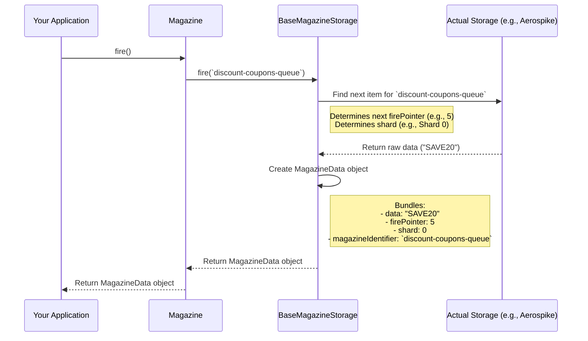

# Chapter 2: MagazineData - Knowing What You Fired

In the [previous chapter](magazine.md), we saw about the `Magazine` concept – a container for homogeneous data. We saw how to `load` data into it and, more importantly, how to `fire` data out when we need to process it. Remember our coupon example?

```java
// From Chapter 1: Firing a coupon code
MagazineData<String> firedData = magazineManager.getMagazine(magazineId).fire();
String couponToSend = firedData.getData(); // We got the coupon code!
```

But wait, what exactly is this `firedData` object? It's not just the raw `String` coupon code. It's something called a `MagazineData`. Why do we need this extra wrapper?

## Why Wrap Fired Data? The Need for Context

Imagine you've fired an coupon code ("SAVE20") from the `discount-coupons-queue` magazine. You try to send the coupon code, but something goes wrong! Maybe user's server is temporarily down.

Now, you want to log this failure. Just logging "Failed to use coupon code" isn't very helpful. You need more details:

1.  **What** data failed? ("SAVE20")
2.  **Which** queue did it come from? (``discount-coupons-queue``)
3.  **Exactly which item** was it in the firing sequence? Was it the 5th item fired today? The 100th?

Knowing the exact item can be crucial for debugging, retrying, or even manually deleting a problematic item later. Simply having the raw data isn't enough; we need **context** or **metadata** about *where* and *when* (in the sequence) the data was fired.

This is precisely what `MagazineData` provides!

## Meet `MagazineData`: The Fired Item with its Tag

Think of `MagazineData` like recovering a bullet that has been fired from a gun. You don't just find the bullet itself; you might also find a small tag attached to it. This tag tells you:

*   The **data** itself (the bullet).
*   The **exact sequence number** when it was fired (e.g., "5th bullet fired").
*   (If applicable) The **specific section** of the magazine it came from (if the magazine was divided, like having multiple barrels).

`MagazineData` bundles your actual data with this important metadata. It typically contains:

1.  `data`: The actual piece of information you stored (like the `String` coupon code, an `Integer` user ID, etc.).
2.  `firePointer`: A number representing the sequential position of this item when it was `fire`d from its specific magazine or shard. Think of it as a unique serial number for fired items within that context.
3.  `shard`: An identifier telling you which specific partition or section of the magazine this data came from. This is particularly relevant when using a feature called [Sharding](sharding.md), which splits a large magazine into smaller parts. If sharding isn't used, this might be a default value or `null`.
4.  `magazineIdentifier`: The unique name of the `Magazine` this data belongs to (e.g., ``discount-coupons-queue``).

## Using `MagazineData`

Let's revisit our `fire` example and see what we can do with the `MagazineData` object:

```java
// Assume magazineManager, magazineId, dataType are set up as before
String magazineId = "discount-coupons-queue";

try {
    // Fire one item
    MagazineData<String> firedInfo = magazineManager.getMagazine(magazineId).fire();
    
    // Access the components of MagazineData
    String couponToSend = firedInfo.getData();             // The actual coupon code
    long sequenceNumber = firedInfo.getFirePointer();      // Its firing sequence number
    Integer shardId = firedInfo.getShard();                // Which shard (if any)
    String originMagazine = firedInfo.getMagazineIdentifier(); // Should be "discount-coupons-queue"

    log.info("Fired item #" + sequenceNumber + " from magazine '" + originMagazine + "' (Shard: " + shardId + ")");
    log.info("Data: " + couponToSend);

    // --- Try processing (e.g., sending coupon) ---
    boolean success = sendCoupon(couponToSend); // Assume this function exists

    if (success) {
        log.info("Successfully processed item #" + sequenceNumber);
    // IMPORTANT: Delete the item after successful processing
    // magazineManager.getMagazine(magazineId).delete(firedInfo);
    // We'll cover delete properly later!
    } else {
        log.info("Failed to process item #" + sequenceNumber + " from magazine '" + originMagazine + "'");
        // Maybe reload it? Or log it for manual review?
        // magazineManager.getMagazine(magazineId).reload(couponToSend);
    }
} catch (NoSuchElementException e) {
    log.error("Magazine is empty. No items to fire.");
} catch (Exception e) {
    log.error("An error occurred during firing or processing: " + e.getMessage());
}
```

**Explanation:**

1.  When `fire()` is successful, it returns a `MagazineData<String>` object (since our magazine holds `String` data). We store this in `firedInfo`.
2.  We can then call methods like `getData()`, `getFirePointer()`, `getShard()`, and `getMagazineIdentifier()` on the `firedInfo` object to retrieve the individual pieces of information.
3.  This extra information (`firePointer`, `shard`, `magazineIdentifier`) is extremely useful for logging, debugging, and potentially for later operations like precisely deleting the item using the `delete` method (which often requires the `MagazineData` object).

## How is `MagazineData` Created? (Under the Hood)

You don't create `MagazineData` objects yourself; the `magazine` library does it for you when you call `fire()`. Here's a simplified view of what happens:

1.  Your application calls `magazine.fire()`.
2.  The `Magazine` object delegates this call to the underlying [BaseMagazineStorage / Storage Strategy](base_magazine_storage__storage_strategy.md) (like `AerospikeStorage`).
3.  The storage strategy does the following:
    *   Determines which item should be fired next (usually the oldest one based on its internal pointers).
    *   Retrieves the actual `data` for that item.
    *   Figures out the `firePointer` associated with this item (often by incrementing a counter).
    *   Identifies the `shard` the item belongs to.
    *   Packages the `data`, `firePointer`, `shard`, and the original `magazineIdentifier` into a new `MagazineData` object.
4.  The storage strategy returns this fully populated `MagazineData` object back to your application.



## Diving into the Code (`MagazineData.java`)

The structure of `MagazineData` is quite simple. It's primarily a data holder class.

--- File: `src/main/java/com/phonepe/magazine/common/MagazineData.java` ---

```java
package com.phonepe.magazine.common;

import lombok.AllArgsConstructor;
import lombok.Builder;
import lombok.Data;
import lombok.NoArgsConstructor;
import java.util.Objects;

@Data // Auto-generates getters, setters, toString, etc.
@Builder // Provides a builder pattern for construction
@NoArgsConstructor // Constructor with no arguments
@AllArgsConstructor // Constructor with all arguments
public class MagazineData<T> {

    private T data;             // The actual data item
    private long firePointer;   // Its sequence number when fired
    private Integer shard;      // The shard ID it came from (nullable)
    private String magazineIdentifier; // The name of the magazine

    /**
     * Helper method used internally by storage (like Aerospike) 
     * to reconstruct the unique key for this data item.
     */
    public String createAerospikeKey() {
        // Combines identifier, shard (if present), and pointer 
        // to create a unique string key.
        // Example: "discount-coupons-queue_shard_0_5" or "my-queue_12"
        return Objects.nonNull(shard)
                ? String.format("%s_%s_%d_%d", magazineIdentifier, Constants.SHARD_PREFIX, shard, firePointer)
                : String.format("%s_%d", magazineIdentifier, firePointer);
    }
}
```

**Explanation:**

*   The class uses generic type `<T>` so it can hold any kind of data (`String`, `Integer`, your custom objects, etc.).
*   The fields `data`, `firePointer`, `shard`, and `magazineIdentifier` directly correspond to the concepts we discussed.
*   Lombok annotations (`@Data`, `@Builder`, etc.) automatically generate standard Java methods like getters (`getData()`, `getFirePointer()`, etc.), making the code concise.
*   The `createAerospikeKey()` method is an internal helper primarily used by the [BaseMagazineStorage / Storage Strategy](base_magazine_storage__storage_strategy.md) (specifically `AerospikeStorage` in this case) to figure out the exact key under which this piece of data is stored, often needed for operations like `delete`. You typically don't need to call this method directly in your application code.

You can see an example of how `MagazineData` is created within the `fireWithRetry` method in `AerospikeStorage.java`:

--- File: `src/main/java/com/phonepe/magazine/impl/aerospike/AerospikeStorage.java` (Simplified Snippet) ---

```java
// Inside fireWithRetry method... after finding the dataRecord and firePointer...

    // ... logic to get dataRecord, firePointer, selectedShard ...

    MagazineData<T> magazineData = null;
    if (/* condition to check if data was found */) {
        
        // Retrieve the actual data from the record
        T actualData = clazz.cast(dataRecord.getValue(Constants.DATA)); 

        // Build the MagazineData object!
        magazineData = MagazineData.<T>builder()
                .firePointer(firePointer)       // Set the sequence number
                .shard(selectedShard)         // Set the shard ID
                .magazineIdentifier(magazineIdentifier) // Set the magazine name
                .data(actualData)             // Set the actual data
                .build(); 

        // ... other logic like incrementing counters ...
    }
    return magazineData; // Return the created object
```

**Explanation:**

*   The storage layer fetches the raw data (`dataRecord`), determines the correct `firePointer` and `selectedShard`.
*   It then uses the `MagazineData.builder()` pattern to construct a new `MagazineData` object, populating it with all the gathered information.
*   This complete `MagazineData` object is then returned to the caller.

## Conclusion

Module describes that when you `fire` an item from a `Magazine`, you get back more than just the data. You receive a `MagazineData` object, which bundles the data with important context: its `firePointer` (sequence number), its originating `shard` (if sharding is used), and the `magazineIdentifier`. This metadata is crucial for robust processing, logging, and debugging.

So far, we've seen how to interact with a *single* `Magazine`. But what if your application needs multiple magazines for different kinds of homogeneous data (e.g., one for coupon codes, one for image processing tasks, one for user notifications)? How do you manage all of them? That's where the `MagazineManager` comes in.

Let's explore how to handle multiple magazines in the next chapter: [Chapter 3: MagazineManager](magazinemanager.md).