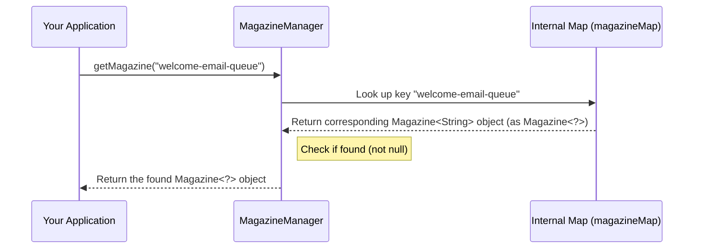

# Chapter 3: MagazineManager - Your Central Magazine Rack

In the previous chapters, we learned about the [Magazine](magazine.md) – a container for temporary data items like bullets in a rifle magazine – and [MagazineData](magazinedata.md) – the object you get back when you `fire` an item, which includes the data plus extra context.

So far, we've focused on using a *single* magazine, like our `"welcome-email-queue"`. But what if your application needs to handle *multiple* kinds of temporary data?

## The Problem: Juggling Many Magazines

Imagine your application is growing. Besides sending welcome emails, you now also need to:

1.  Queue up user profile pictures for background resizing (`"image-resize-queue"`).
2.  Temporarily store IDs of users who need a security check (`"security-check-queue"`).
3.  Buffer analytics events before sending them in batches (`"analytics-event-queue"`).

Each of these tasks needs its *own* `Magazine` because they hold different types of data (email addresses are `String`, image task details might be a custom `ImageTask` object, user IDs could be `Integer`, analytics events might be `EventData` objects).

How do you keep track of all these different magazines? Where do you get the right magazine when you need it? Just creating `Magazine` objects scattered throughout your code can quickly become messy and hard to manage.

## The Solution: `MagazineManager`

This is where `MagazineManager` comes to the rescue!

Think of `MagazineManager` as the **librarian** of your magazines, or a **central rack** designed to hold many different rifle magazines.

*   You **tell the `MagazineManager` about all the magazines** your application uses (like registering books with the librarian).
*   When you need a specific magazine, you **ask the `MagazineManager` for it using its unique name** (`magazineIdentifier`).
*   The `MagazineManager` finds the right magazine on the rack and hands it to you.

It acts as a single, organized point of access for all your `Magazine` instances.

Here are the key ideas:

1.  **Central Registry:** It holds references to all the different `Magazine` objects you configure.
2.  **Access by ID:** You retrieve a specific `Magazine` using its unique `magazineIdentifier`.
3.  **Dynamic Refresh:** You can update the set of magazines the manager knows about using a `refresh` mechanism.

## Using `MagazineManager`

Let's see how to use the `MagazineManager` in practice.

### 1. Creating the Manager

First, you need to create an instance of `MagazineManager`. It usually requires a `clientId`, which is just a name to identify your application instance (useful in distributed systems, but for now, think of it as a label).

```java
// Give your application instance a name
String myAppClientId = "order-processing-service-instance-1"; 

// Create the manager
MagazineManager magazineManager = new MagazineManager(myAppClientId);

System.out.println("MagazineManager created for client: " + magazineManager.getClientId()); 
```

**Explanation:**
*   We create a `MagazineManager` object using its constructor.
*   We pass a `clientId` string.
*   Now we have a `magazineManager` variable ready to be configured.

### 2. Preparing Your Magazines

The `MagazineManager` doesn't create the actual `Magazine` objects for you. You need to define and create them first, usually during your application's startup or configuration phase.

Creating a `Magazine` involves specifying:
*   Its unique `magazineIdentifier` (e.g., `"welcome-email-queue"`).
*   The type of data it will hold (e.g., `String.class`).
*   The underlying storage mechanism it should use ([BaseMagazineStorage / Storage Strategy](base_magazine_storage__storage_strategy.md) - we'll cover this in the next chapter!).

For now, let's imagine we have created two `Magazine` objects (we'll see *how* to create them fully in the next chapter):

```java
// --- Conceptual Example (Full creation depends on Storage Strategy) ---

// Imagine we have configured and created these Magazine objects:
Magazine<String> emailMagazine = /* ... created with ID "welcome-email-queue" ... */;
Magazine<Integer> securityCheckMagazine = /* ... created with ID "security-check-queue" ... */; 

// We need a list to hold them
List<Magazine<?>> allMyMagazines = new ArrayList<>();
allMyMagazines.add(emailMagazine);
allMyMagazines.add(securityCheckMagazine);

System.out.println("Prepared a list of " + allMyMagazines.size() + " magazines.");
```

**Explanation:**
*   Assume we have successfully created `Magazine` instances for our different queues.
*   We put these `Magazine` objects into a `List`. The `<?>` (wildcard) means the list can hold `Magazine` objects of *any* data type (`String`, `Integer`, etc.).

### 3. Refreshing the Manager

Now, we need to tell the `MagazineManager` about the magazines we prepared. We do this using the `refresh` method.

```java
// Assume magazineManager and allMyMagazines from previous steps exist

// Tell the manager about our magazines
magazineManager.refresh(allMyMagazines);

System.out.println("MagazineManager refreshed. It now knows about our magazines.");
```

**Explanation:**
*   The `refresh(magazines)` method takes the `List<Magazine<?>>` we created.
*   It updates the manager's internal registry, making it aware of `"welcome-email-queue"` and `"security-check-queue"`. If `refresh` is called again later with a different list, it will replace the old set of known magazines with the new one.

### 4. Getting and Using a Specific Magazine

Once the manager is refreshed, you can ask for a specific magazine anytime you need it, using its `magazineIdentifier`.

```java
// Assume magazineManager is created and refreshed

String emailQueueId = "welcome-email-queue";
String securityQueueId = "security-check-queue";

try {
    // Get the magazine for welcome emails (we know it holds Strings)
    Magazine<String> welcomeEmailMag = magazineManager.getMagazine(emailQueueId);
    
    // Now use it just like in Chapter 1!
    welcomeEmailMag.load("newbie@example.com");
    System.out.println("Loaded email via manager.");

    // Get the magazine for security checks (we know it holds Integers)
    Magazine<Integer> securityCheckMag = magazineManager.getMagazine(securityQueueId);
    
    // Use it
    securityCheckMag.load(12345); // Load user ID 12345
    System.out.println("Loaded user ID via manager.");

    // Try to get a magazine that doesn't exist
    // Magazine<Double> nonExistentMag = magazineManager.getMagazine("unknown-queue"); 

} catch (MagazineException e) {
    // Handle the case where the magazine identifier is not found
    System.err.println("Error getting magazine: " + e.getMessage()); 
} catch (Exception e) {
    // Handle other potential errors (like ClassCastException, see below)
    System.err.println("An unexpected error occurred: " + e.getMessage());
}
```

**Explanation:**
1.  We use `magazineManager.getMagazine(identifier)` to retrieve a magazine.
2.  We provide the unique `magazineIdentifier` (e.g., `"welcome-email-queue"`).
3.  The manager looks up and returns the corresponding `Magazine` object.
4.  **Important Type Safety Note:** The `getMagazine` method in the current library version returns a `Magazine<?>`. You need to cast it to the correct specific type (like `Magazine<String>` or `Magazine<Integer>`). If you try to get a magazine using an identifier that the manager doesn't know about (like `"unknown-queue"`), it will throw a `MagazineException`. If you mistakenly cast the result to the wrong type (e.g., casting the email magazine to `Magazine<Integer>`), you might get a `ClassCastException` later when you try to use it. It's crucial that *you* know the correct data type associated with each `magazineIdentifier`.

## How Does it Work Internally? (Under the Hood)

The `MagazineManager` is actually quite simple internally. It primarily acts as a holder for a map.

**Analogy:** Think of the librarian (`MagazineManager`) having an index card box (`Map`). Each card has a book title (`magazineIdentifier`) and points to the shelf location (`Magazine` object reference).

**Core Mechanism:**
The `MagazineManager` uses a `java.util.Map` (specifically, a `HashMap`) called `magazineMap`.
*   The **keys** of the map are the `String` magazine identifiers (e.g., `"welcome-email-queue"`).
*   The **values** of the map are the actual `Magazine<?>` objects themselves.

**Sequence of Getting a Magazine:**



**Code Dive:**

Let's look at the relevant parts of `src/main/java/com/phonepe/magazine/MagazineManager.java`:

```java
// File: src/main/java/com/phonepe/magazine/MagazineManager.java

import com.phonepe.magazine.exception.ErrorCode;
import com.phonepe.magazine.exception.MagazineException;
import lombok.Data; // Auto-generates getters, etc.

import java.util.HashMap;
import java.util.List;
import java.util.Map;
import java.util.Objects;

@Data // Using Lombok for boilerplate code
public class MagazineManager {

    private final String clientId;
    // The core internal storage: a map from identifier to Magazine object
    private final Map<String, Magazine<?>> magazineMap = new HashMap<>(); 

    // Constructor sets the clientId
    public MagazineManager(final String clientId) {
        this.clientId = clientId;
    }

    // The refresh method implementation
    public void refresh(final List<Magazine<?>> magazines) {
        // Clears the old map (optional, could also merge) 
        // magazineMap.clear(); // Current impl doesn't clear, it overwrites/adds
        
        // Puts each magazine from the list into the map
        magazines.forEach(magazine -> 
            magazineMap.put(magazine.getMagazineIdentifier(), magazine)); 
    }

    // The getMagazine method implementation
    @SuppressWarnings("unchecked") // Suppress warning about the cast below
    public <T> Magazine<T> getMagazine(final String magazineIdentifier) {
        // 1. Look up the identifier in the map
        Magazine<T> magazine = (Magazine<T>) (magazineMap.get(magazineIdentifier)); 

        // 2. Check if the magazine was found
        if (Objects.isNull(magazine)) {
            // 3. If not found, throw a specific exception
            throw MagazineException.builder()
                    .message(String.format("Magazine not found for identifier %s", magazineIdentifier))
                    .errorCode(ErrorCode.MAGAZINE_NOT_FOUND)
                    .build();
        }
        // 4. If found, return it (after casting)
        return magazine; 
    }
}
```

**Explanation:**
*   `magazineMap`: This `HashMap` is the heart of the manager, storing the identifier-to-magazine mappings.
*   `refresh()`: This method iterates through the provided list of `Magazine` objects. For each one, it calls `magazineMap.put()`, using the magazine's identifier as the key and the magazine object itself as the value. This populates or updates the map.
*   `getMagazine()`: This method performs a lookup in the `magazineMap` using `magazineMap.get(magazineIdentifier)`.
    *   It checks if the result is `null` (meaning no magazine with that ID was found) and throws a `MagazineException` if so.
    *   If found, it casts the result (which is stored as `Magazine<?>`) to the expected type `Magazine<T>` using `(Magazine<T>)`. The `@SuppressWarnings("unchecked")` annotation tells the compiler to ignore warnings about this potentially unsafe cast. This is why it's crucial for the *caller* to know the correct type `T` associated with the `magazineIdentifier`.
    *   Finally, it returns the found (and cast) `Magazine` object.

## Conclusion

You've now learned about the `MagazineManager`, the central coordinator for handling multiple `Magazine` instances in your application. It acts like a librarian or a rack, allowing you to easily register (`refresh`) and retrieve (`getMagazine`) specific magazines using their unique identifiers. This keeps your code organized when dealing with various types of temporary data queues.

We briefly mentioned that creating a `Magazine` involves specifying an underlying storage mechanism. But how does the data actually get saved reliably? How does the `Magazine` interact with storage like memory, files, or databases? That's the topic of our next chapter!

Let's dive into the storage layer: [Chapter 4: BaseMagazineStorage / Storage Strategy](base_magazine_storage__storage_strategy.md).