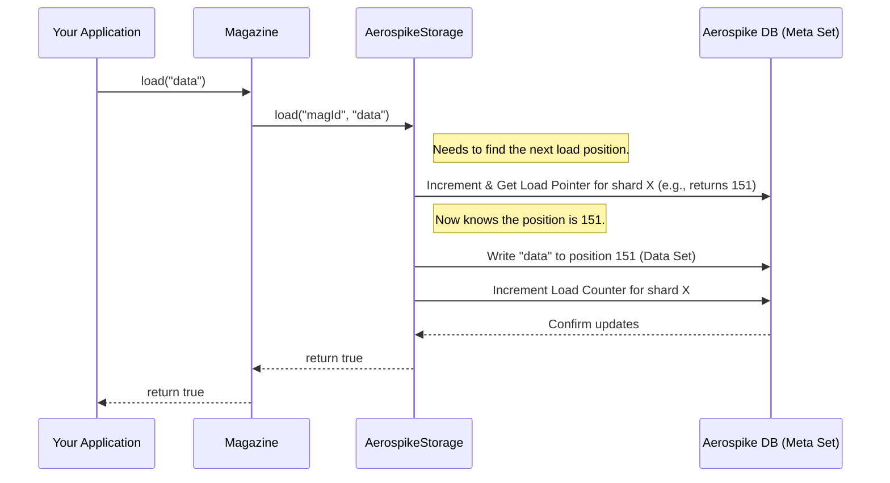
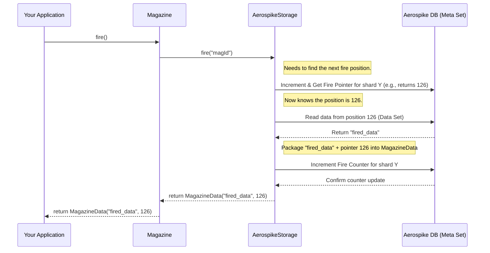

# Chapter 5: MetaData (Pointers & Counters)

In the [previous chapter](base_magazine_storage__storage_strategy.md), we learned how the `Magazine` relies on a `BaseMagazineStorage` strategy (like `AerospikeStorage`) to actually save and retrieve data. The storage strategy is the engine doing the real work.

But how does this engine keep track of everything? Imagine you have a physical magazine for a rifle. You need to know:

1.  Where's the next empty slot to load a bullet?
2.  Which bullet is currently at the top, ready to be fired?
3.  Maybe even, how many bullets have you loaded *in total* over the magazine's lifetime?
4.  And how many have you fired *in total*?

Our digital `Magazine` needs similar tracking information to function correctly. This tracking information is called **MetaData**.

## What is MetaData? Keeping Score!

MetaData, in the context of our `Magazine`, is simply a set of numbers that the underlying [BaseMagazineStorage / Storage Strategy](base_magazine_storage__storage_strategy.md) uses to track the internal state of a specific `Magazine` (or one of its smaller partitions, called shards - more on that in [Chapter 7: Sharding](sharding.md)).

Think of it like the dashboard or control panel for a single magazine instance. It mainly consists of four key pieces of information:

1.  **`loadPointer`**: This is like an **index** or a **position marker**. It points to the *next available slot* where a new data item will be loaded. When you `load` an item, the storage puts it at the `loadPointer` position and then moves the `loadPointer` forward.
2.  **`firePointer`**: This is also an **index** or **position marker**. It points to the position of the *next data item that should be fired*. When you `fire` an item, the storage takes the item from the `firePointer` position and then usually moves the `firePointer` forward.
3.  **`loadCounter`**: This is a simple **counter**. It keeps track of the *total number of items ever successfully loaded* into this specific magazine (or shard) since it was created. It always goes up.
4.  **`fireCounter`**: This is another **counter**. It tracks the *total number of items ever successfully fired* from this specific magazine (or shard). It also always goes up.

**Analogy:**

Imagine a simple conveyor belt (our magazine storage):

*   `loadPointer`: A worker standing at one end, pointing to the exact spot where the *next* box should be placed onto the belt.
*   `firePointer`: Another worker at the other end, pointing to the *next* box ready to be taken off the belt.
*   `loadCounter`: A clicker counter held by the loading worker, incremented every time a box is successfully placed.
*   `fireCounter`: A similar clicker counter held by the unloading worker, incremented every time a box is successfully removed.

## The `MetaData` Class

The `magazine` library provides a simple Java class to hold these four values together: `MetaData`.

--- File: `src/main/java/com/phonepe/magazine/common/MetaData.java` ---

```java
package com.phonepe.magazine.common;

import lombok.AllArgsConstructor;
import lombok.Builder;
import lombok.Data;
import lombok.NoArgsConstructor;

@Data // Auto-generates getters, setters, toString, etc.
@Builder // Provides a builder pattern
@NoArgsConstructor // Default constructor
@AllArgsConstructor // Constructor with all fields
public class MetaData {

    private long fireCounter; // Total items fired
    private long loadCounter; // Total items loaded
    private long firePointer; // Next position to fire from
    private long loadPointer; // Next position to load into
}
```

**Explanation:**

*   This is a straightforward data class.
*   It has fields for `fireCounter`, `loadCounter`, `firePointer`, and `loadPointer`, all of type `long` (a large whole number).
*   The Lombok annotations (`@Data`, `@Builder`, etc.) automatically create useful methods like `getLoadPointer()`, `getFireCounter()`, etc., so you don't have to write them manually.

## How to Get the MetaData

You can ask a `Magazine` for its current metadata using the `getMetaData()` method. This is useful for monitoring the state of your queue.

```java
// Assume magazineManager is set up, and we have our email magazine
MagazineManager magazineManager = /* ... */;
String magazineId = "welcome-email-queue";

try {
    // Get the magazine
    Magazine<String> emailMagazine = magazineManager.getMagazine(magazineId);

    // Get its metadata
    Map<String, MetaData> metadataMap = emailMagazine.getMetaData();

    // Print the metadata
    System.out.println("Metadata for magazine '" + magazineId + "':");
    for (Map.Entry<String, MetaData> entry : metadataMap.entrySet()) {
        String shardKey = entry.getKey(); // Identifier for the shard/partition
        MetaData meta = entry.getValue(); // The MetaData object for that shard

        log.info("  Shard/Partition: " + shardKey);
        log.info("    Load Pointer : " + meta.getLoadPointer());
        log.info("    Fire Pointer : " + meta.getFirePointer());
        log.info("    Load Counter : " + meta.getLoadCounter());
        log.info("    Fire Counter : " + meta.getFireCounter());
        log.info("    Items Pending: " + (meta.getLoadPointer() - meta.getFirePointer())); // Approximate
    }

} catch (Exception e) {
    log.error("Error getting metadata: " + e.getMessage());
}
```

**Explanation:**

1.  We get our specific `Magazine` object using the `MagazineManager`.
2.  We call `emailMagazine.getMetaData()`.
3.  This method returns a `Map<String, MetaData>`.
    *   **Why a Map?** Because a single `Magazine` might be internally split into multiple partitions or **shards** for better performance (covered in [Chapter 7: Sharding](sharding.md)). Each shard has its *own* set of pointers and counters. The `Map` uses a key (like `"SHARD_0"`, `"SHARD_1"`) to identify each shard and maps it to its corresponding `MetaData` object. If sharding is not used (only 1 shard), the map will likely contain a single entry.
4.  We loop through the map entries and print the values from each `MetaData` object using its getter methods (`getLoadPointer()`, `getFirePointer()`, etc.).
5.  We can estimate the number of items currently waiting to be processed in a shard by subtracting the `firePointer` from the `loadPointer`.

**Example Output (for a magazine with 2 shards):**

```
Metadata for magazine 'welcome-email-queue':
  Shard/Partition: SHARD_0
    Load Pointer : 150
    Fire Pointer : 125
    Load Counter : 150
    Fire Counter : 125
    Items Pending: 25
  Shard/Partition: SHARD_1
    Load Pointer : 148
    Fire Pointer : 123
    Load Counter : 148
    Fire Counter : 123
    Items Pending: 25
```

This tells us that in `SHARD_0`, 150 items have been loaded, 125 have been fired, the next item to load will go to position 150, the next to fire is at position 125, and there are roughly 25 items pending. Similar information is shown for `SHARD_1`.

## How MetaData is Managed Internally (Under the Hood)

You don't update these pointers and counters directly. The [BaseMagazineStorage / Storage Strategy](base_magazine_storage__storage_strategy.md) implementation (like `AerospikeStorage`) manages them automatically when you call `load`, `fire`, or `reload`.

**Simplified Flow for `load`:**



**Simplified Flow for `fire`:**



**Key Internal Implementation Details (using `AerospikeStorage` as example):**

*   **Separate Records:** `AerospikeStorage` typically stores the metadata separately from the actual data items. It uses a dedicated "meta set" (configured via `metaSetName`) in Aerospike.
*   **Pointer & Counter Records:** Within the meta set, it often creates specific records for each shard to hold the pointers and counters. For example, for `magazineIdentifier="queue1"` and `shard=0`, there might be:
    *   A record with key `"queue1_SHARD_0_POINTERS"` holding the `loadPointer` and `firePointer` values.
    *   A record with key `"queue1_SHARD_0_COUNTERS"` holding the `loadCounter` and `fireCounter` values.
*   **Atomic Operations:** Crucially, when updating these values (like incrementing `loadPointer`), AerospikeStorage uses **atomic operations** provided by Aerospike (like `Operation.add`). This ensures that even if multiple parts of your application try to `load` or `fire` items at the exact same time, the pointers and counters are updated correctly without race conditions.

Let's look at a highly simplified snippet showing how `AerospikeStorage` might increment the load pointer:

--- File: `src/main/java/com/phonepe/magazine/impl/aerospike/AerospikeStorage.java` (Conceptual Snippet) ---

```java
// Inside AerospikeStorage, simplified logic for getting next load pointer

private long incrementAndGetLoadPointer(final String magazineIdentifier,
                                         final Integer selectedShard) {
    try {
        // 1. Create the key for the POINTERS record for this shard
        String metaKey = createKey(magazineIdentifier, selectedShard, Constants.POINTERS); 
        // Example key: "welcome-email-queue_SHARD_0_POINTERS"

        // 2. Define the atomic 'add 1' operation for the load pointer bin
        Bin loadPointerBin = new Bin(Constants.LOAD_POINTER, 1L); // Bin name & value to add
        Operation addOperation = Operation.add(loadPointerBin);   // Atomic add

        // 3. Define an operation to read the result back
        Operation getOperation = Operation.get(Constants.LOAD_POINTER); 

        // 4. Execute both operations atomically on Aerospike
        Record resultRecord = (Record) retryerFactory.getRetryer().call(() -> 
            aerospikeClient.operate(
                /* write policy */, 
                new Key(namespace, metaSetName, metaKey), // Target record key
                addOperation, // Increment the pointer
                getOperation  // Get the new value
            )
        );
        
        // 5. Extract the new load pointer value from the result
        return resultRecord.getLong(Constants.LOAD_POINTER); 

    } catch (Exception e) {
        // Handle errors...
        throw handleException(e, "Error reading pointers", magazineIdentifier, null);
    }
}
```

**Explanation:**

*   The code determines the correct key for the metadata record holding the pointers.
*   It uses `Operation.add` to tell Aerospike "add 1 to the value in the `LOAD_POINTER` bin".
*   It simultaneously uses `Operation.get` to read the *new* value after the addition.
*   Aerospike performs these together atomically, guaranteeing correctness.
*   The updated pointer value is returned.
*   Similar logic exists for incrementing the `firePointer` and the `loadCounter`/`fireCounter`.

## Conclusion

You've now learned about the vital role of **MetaData** – specifically `loadPointer`, `firePointer`, `loadCounter`, and `fireCounter` – in managing the internal state of a `Magazine`. These values are maintained automatically by the underlying storage strategy (like `AerospikeStorage`) using atomic operations. You can access this metadata using `magazine.getMetaData()` to monitor your queues, understand throughput, and estimate pending items.

These pointers and counters are fundamental building blocks. They are also crucial for implementing more advanced features, such as preventing the same item from being processed multiple times if something goes wrong, and ensuring safe operations when multiple processes access the same magazine concurrently.

In the next chapter, we'll explore exactly how the library handles these challenges: [Chapter 6: Concurrency Control & Deduplication](concurrency_control__deduplication.md).