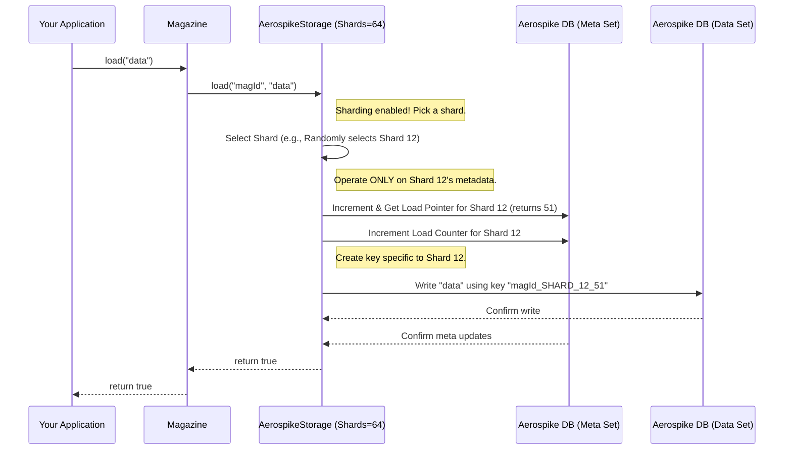
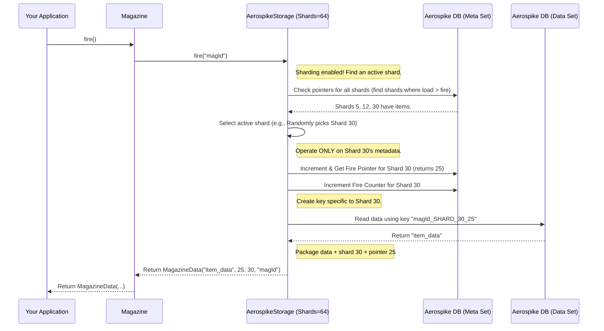

# Chapter 7: Sharding

Welcome to the final chapter of our core concepts tutorial! In [Chapter 6: Concurrency Control & Deduplication](concurrency_control__deduplication.md), we explored how the `magazine` library handles simultaneous operations and prevents duplicate data entries, making it robust for busy applications.

Now, let's think about scale. What happens when a single `Magazine`, like our `"welcome-email-queue"`, becomes extremely popular and needs to handle millions or even billions of items?

## The Problem: One Giant Queue Can Be Slow

Imagine your `Magazine` as one incredibly long conveyor belt.

*   **Loading:** When you `load` a new item, your worker has to walk to the very end of the belt to place it.
*   **Firing:** When you `fire` an item, another worker takes it from the front.

If the belt gets really, really long (millions of items), managing it can become inefficient:
1.  **Bottleneck:** Even with fast storage, updating the pointers (`loadPointer`, `firePointer`) for this single massive belt might become a bottleneck. Only one `load` or `fire` operation can update the pointers at a time (using atomic operations, but still sequential for *that specific* set of pointers).
2.  **Scalability Limit:** You might hit limits on how quickly a single queue structure can be processed.

How can we handle a massive workload more efficiently?

## The Solution: Sharding - Many Belts are Better Than One!

The solution is **Sharding**. It's an internal strategy used by storage implementations like `AerospikeStorage` to break down one logical `Magazine` into multiple smaller, independent physical partitions, called **shards**.

**Analogy:** Instead of one enormous conveyor belt, imagine replacing it with several shorter conveyor belts working side-by-side, all serving the *same logical purpose* (e.g., handling welcome emails).

*   **Logical Magazine:** You still interact with a single `Magazine` object named `"welcome-email-queue"`.
*   **Physical Shards:** Internally, the storage splits this into, say, 64 separate partitions (Shard 0, Shard 1, ... Shard 63).
*   **Independent Operation:** Each shard acts like its own mini-magazine. It has its *own* set of [MetaData (Pointers & Counters)](metadata_pointers_counters.md) (`loadPointer`, `firePointer`, etc.).

**How it Works:**

1.  **Loading:** When you call `magazine.load(data)`, the storage strategy (like `AerospikeStorage`) picks one of the shards (often randomly, like rolling a 64-sided die) and loads the data into *that specific shard*. It updates only the pointers and counters for the chosen shard.
2.  **Firing:** When you call `magazine.fire()`, the storage strategy looks for a shard that has items waiting (`loadPointer > firePointer`). It picks one of these eligible shards (again, maybe randomly) and fires the next item from *that shard*, updating only its `firePointer` and `fireCounter`.

**Benefits:**

*   **Parallelism:** Multiple `load` and `fire` operations can happen *concurrently* across different shards, as they are updating independent sets of pointers/counters. Worker 1 can load onto Shard 5 while Worker 2 fires from Shard 10 simultaneously.
*   **Scalability:** Distributes the load and storage across multiple partitions, potentially improving throughput and handling larger volumes of data more gracefully.

## Using Sharding: It's Mostly Automatic!

The beauty of sharding in the `magazine` library is that it's largely an **internal implementation detail** managed by the storage strategy. Your code that uses the `Magazine` object generally doesn't need to change much.

### Configuration

The main way you interact with sharding is by configuring the number of shards when you set up the [BaseMagazineStorage / Storage Strategy](base_magazine_storage__storage_strategy.md).

Let's look at the `AerospikeStorageConfig` again:

```java
// Example: Configuring Aerospike storage

AerospikeStorageConfig storageConfig = AerospikeStorageConfig.builder()
    .namespace("my_app_namespace")
    .dataSetName("email_queue_data")
    .metaSetName("email_queue_meta")
    .recordTtl(3600) 
    // --- Configure the number of shards ---
    .shards(64) // <-- Use 64 shards for this magazine! (Default is often 64)
    // .shards(1) // <-- Or explicitly use only 1 shard (no sharding)
    .metaDataTtl(86400)
    .build();

// Create the storage instance (assuming aerospikeClient, etc. are set up)
AerospikeStorage<String> emailStorage = AerospikeStorage.<String>builder()
    .aerospikeClient(aerospikeClient)
    .storageConfig(storageConfig) 
    // ... other config like enableDeDupe, clazz, clientId ...
    .build();

System.out.println("AerospikeStorage configured with " + emailStorage.getShards() + " shards."); 

// Now, create the Magazine using this storage strategy
// Magazine<String> emailMagazine = new Magazine<>("welcome-email-queue", emailStorage);
```

**Explanation:**

*   We use the `.shards(numberOfShards)` method on the `AerospikeStorageConfig.builder()`.
*   Setting it to a value greater than 1 (e.g., `64`) enables sharding. The storage strategy will manage these internal partitions. The default in `AerospikeStorage` is often 64.
*   Setting it to `1` effectively disables sharding, making it behave like the single-queue model.
*   The `Magazine` object you create using this `emailStorage` will now operate with the configured number of shards internally.

### Impact on Usage

*   **`load`, `fire`, `reload`:** These methods on the `Magazine` object work exactly the same way from your code's perspective. You don't need to specify a shard.
    ```java
    // Code looks the same whether sharding is enabled or not
    emailMagazine.load("user@example.com"); 
    MagazineData<String> firedItem = emailMagazine.fire();
    ```
*   **`getMetaData`:** As we saw in [Chapter 5: MetaData (Pointers & Counters)](metadata_pointers_counters.md), this method returns a `Map<String, MetaData>`. When sharding is enabled, this map will contain an entry for *each shard*, allowing you to see the state of each partition.
    ```java
    Map<String, MetaData> metadataMap = emailMagazine.getMetaData();
    // If shards=64, this map will have 64 entries like:
    // "SHARD_0" -> MetaData for shard 0
    // "SHARD_1" -> MetaData for shard 1
    // ...
    // "SHARD_63" -> MetaData for shard 63 
    ```
*   **`MagazineData`:** The `MagazineData` object returned by `fire()` contains a `shard` field. When sharding is enabled, this field will tell you which specific shard the data item came from.
    ```java
    MagazineData<String> firedInfo = emailMagazine.fire();
    if (firedInfo != null) {
        String email = firedInfo.getData();
        Integer shardId = firedInfo.getShard(); // Get the shard ID (e.g., 0, 1, ..., 63)
        long pointer = firedInfo.getFirePointer(); // Pointer within that shard

        log.info("Fired '" + email + "' from Shard: " + shardId + " at position " + pointer);
    }
    ```

## How it Works Internally (Under the Hood)

Sharding primarily changes how the storage strategy (like `AerospikeStorage`) handles keys and manages pointers/counters.

**Simplified `load` with Sharding:**



**Simplified `fire` with Sharding:**



**Code Dive (`AerospikeStorage.java` Snippets):**

1.  **Selecting a Shard for Loading:** `AerospikeStorage` uses a simple random selection.
    ```java
    // File: src/main/java/com/phonepe/magazine/impl/aerospike/AerospikeStorage.java

    // Helper method to select a shard if sharding is enabled
    private Integer selectShard() {
        // getShards() returns the configured number of shards
        return getShards() > 1 
                ? random.nextInt(getShards()) // Pick a random shard index (0 to shards-1)
                : null; // Return null if only 1 shard (no sharding)
    }
    
    // In the load method:
    // final Integer selectedShard = selectShard(); // Get null or a shard index (0, 1, ...)
    ```
2.  **Creating Shard-Specific Keys:** The keys used to store metadata and data in Aerospike include the shard ID.
    ```java
    // File: src/main/java/com/phonepe/magazine/impl/aerospike/AerospikeStorage.java
    
    // Helper method to create keys
    private String createKey(final String magazineIdentifier,
            final Integer shard, // The selected shard index (or null)
            final String suffix) { // e.g., "POINTERS", "COUNTERS", or a loadPointer value
        return shard != null // Check if sharding is active (shard is not null)
                ? String.join(Constants.KEY_DELIMITER, // e.g., "_"
                        magazineIdentifier,
                        Constants.SHARD_PREFIX, // e.g., "SHARD"
                        String.valueOf(shard), // e.g., "12"
                        suffix) // e.g., "POINTERS" -> "magId_SHARD_12_POINTERS"
                : String.join(Constants.KEY_DELIMITER, 
                        magazineIdentifier, 
                        suffix); // No shard -> "magId_POINTERS"
    }
    ```
3.  **Updating Shard Metadata:** Operations like incrementing pointers/counters use the `createKey` method to target the specific record for the selected shard.
    ```java
    // File: src/main/java/com/phonepe/magazine/impl/aerospike/AerospikeStorage.java (Simplified)

    // Example: Incrementing load pointer for a specific shard
    private long incrementAndGetLoadPointer(final String magazineIdentifier,
            final Integer selectedShard) { // Pass in the chosen shard
        
        // Key will be like "magId_SHARD_12_POINTERS" or "magId_POINTERS"
        final String key = createKey(magazineIdentifier, selectedShard, Constants.POINTERS); 
        
        // Use Aerospike atomic 'operate' command on this specific key
        Record resultRecord = aerospikeClient.operate(
            /* write policy */, 
            new Key(namespace, metaSetName, key), // Target the specific shard's pointer record
            Operation.add(new Bin(Constants.LOAD_POINTER, 1L)), // Increment its load pointer
            Operation.get(Constants.LOAD_POINTER) // Get the new value
        );
        // ... (handle errors) ...
        return resultRecord.getLong(Constants.LOAD_POINTER);
    } 
    ```
4.  **Getting Metadata for All Shards:** The `getMetaData` implementation loops through all possible shard IDs (0 to shards-1) and fetches the metadata for each one.
    ```java
    // File: src/main/java/com/phonepe/magazine/impl/aerospike/AerospikeStorage.java (Simplified getMetaData)

    @Override
    public Map<String, MetaData> getMetaData(final String magazineIdentifier) {
        try {
            // Create keys for COUNTERS for all shards (0 to shards-1)
            Key[] counterKeys = createMetaKeys(magazineIdentifier, Constants.COUNTERS);
            // Create keys for POINTERS for all shards
            Key[] pointerKeys = createMetaKeys(magazineIdentifier, Constants.POINTERS);

            // Batch read all counter records from Aerospike
            Record[] counterRecords = aerospikeClient.get(null, counterKeys);
            // Batch read all pointer records
            Record[] pointerRecords = aerospikeClient.get(null, pointerKeys);

            // Build the result map
            return IntStream.range(0, getShards()) // Loop from 0 to shards-1
                    .boxed()
                    .collect(Collectors.toMap(
                            // Key for the map: "SHARD_0", "SHARD_1", etc.
                            i -> String.join(Constants.KEY_DELIMITER, Constants.SHARD_PREFIX, String.valueOf(i)), 
                            // Value for the map: Build MetaData object from records for shard 'i'
                            i -> MetaData.builder()
                                    .fireCounter(counterRecords[i] != null ? counterRecords[i].getLong(Constants.FIRE_COUNTER) : 0L)
                                    .loadCounter(counterRecords[i] != null ? counterRecords[i].getLong(Constants.LOAD_COUNTER) : 0L)
                                    .firePointer(pointerRecords[i] != null ? pointerRecords[i].getLong(Constants.FIRE_POINTER) : 0L)
                                    .loadPointer(pointerRecords[i] != null ? pointerRecords[i].getLong(Constants.LOAD_POINTER) : 0L)
                                    .build()
                    ));
        } catch (Exception e) {
            // Handle errors...
        }
    }
    ```

## Conclusion

You've now learned about **Sharding**, an important internal technique used by storage strategies like `AerospikeStorage` to improve the performance and scalability of a `Magazine`. By dividing a single logical magazine into multiple physical shards, each with its own metadata, the library can distribute the workload and allow for more concurrent operations.

While sharding happens mostly behind the scenes, you configure it by setting the number of shards when creating the storage strategy. It primarily affects the output of `getMetaData` (returning data per shard) and adds context to `MagazineData` (indicating the source shard).

This concludes our tour of the core concepts behind the `magazine` library! You've journeyed from the basic `Magazine` idea through `MagazineData`, `MagazineManager`, storage strategies, metadata management, concurrency control, and finally, sharding. With this foundation, you should be well-equipped to understand and use the library effectively for managing temporary data in your applications.